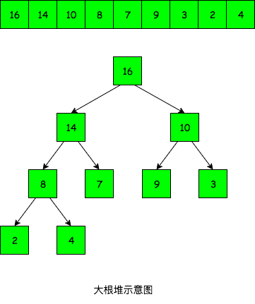

常见排序算法的分类

### 插入类排序

基本思想：每次将一个元素插入到前面已经排好序的子序列中

主要包括：`直接插入排序`、`折半插入排序`

### 交换类排序

基本思想：根据两个元素的比较结果来交换两个元素在序列中的位置。

主要包括：`冒泡排序`、`快速排序`

### 选择类排序

基本思想：每趟都从待排序列中选取一个最小值作为序列的第i个元素,直到第n-1趟，待排序列只剩下一个元素。

主要包括：`简单选择排序`、`堆排序`(借助`完全二叉树`的概念)、`归并排序`

## 直接插入排序

基本思想：一个数组, 左边有序(起始只有一个元素), 把右边元素依次插入到左边的有序表

算法描述：

```java {11-13,15}
// 直接插入排序
public void insertSort(int[] array, int n) {
    int i, j;
    // [1, n-1]依次插入到前面的有序表
    for (i = 1; i <= n - 1; i++) {
        // 临时存放待插入元素
        int tmp = array[i];
        // 若tmp小于前序, 需将前序后移并寻找插入位置
        if (tmp < array[i - 1]) {
            // 向前逐个比较，大于tmp的元素都要后移，寻找插入位置
            for (j = i - 1; j >= 0 && tmp < array[j]; j--) {
                array[j + 1] = array[j];
            }
            // 找到插入位置(array[j]后面)
            array[j + 1] = tmp;
        }
    }
}
```

* 空间复杂度: `O(1)`, 借助于了一个临时存放单元
* 时间复杂度: `O(n^2)`, 最好情况下, 元素已经有序, 时间复杂度为`O(n)`
* 稳定性: 稳定
* 适用场景: 基本有序

## 折半插入排序

基本思想：也是左边有序, 右边依次插入有序表, 不同的是找插入位置时, 使用折半查找法

算法描述：

```java {10-17,19-21}
// 折半插入排序
public void binaryInsertSort(int[] array, int n) {
    int i, j;
    // [1, n-1]依次插入到前面的有序表
    for (i = 1; i <= n - 1; i++) {
        // 临时存放待插入元素
        int tmp = array[i];
        int left = 0, right = i - 1;
        // 折半法寻找tmp的插入位置
        while (left <= right) {
            int mid = (left + right) / 2;
            if (tmp < array[mid]) {
                right = mid - 1;
            } else {
                left = mid + 1;
            }
        }
        // 移动元素 出循环后有 left > right 且 left = right + 1
        for (j = i - 1; j >= left; j--) {
            array[j + 1] = array[j];
        }
        array[left] = tmp;
    }
}
```

* 空间复杂度: `O(1)`
* 时间复杂度: `O(n^2)`, 仅减少了比较次数, 大约为`O(nlogn)`(log表示以2为底的对数), 且比较次数与初始顺序无关
* 稳定性: 稳定
* 适用场景: 数据量不大

## 冒泡排序

基本思想：从后向前(也可从前向后)依次比较相邻两元素，若为逆序则交换，这样一趟冒泡会把最小的元素交换到第一个位置; 下一趟冒泡时,
第一个元素就不再参与了，这样每次都把最小元素交换到前面，总共进行`n-1`趟冒泡就可以了。

算法描述：

```java {8-13}
// 冒泡排序
public void bubbleSort(int[] array, int n) {
    // 外层循环控制排序的趟数(n-1 趟)
    for (int i = 0; i < n - 1; i++) {
        // 内层循环用于比较和交换，即一趟冒泡
        for (int j = n - 1; j > i; j--) {
            // 相邻元素比较
            if (array[j] < array[j - 1]) {
                // 交换相邻元素
                int tmp = array[j];
                array[j] = array[j - 1];
                array[j - 1] = tmp;
            }
        }
    }
}
```

* 空间复杂度：`O(1)`
* 时间复杂度：`O(n^2)`，最好情况下，元素已经有序，时间复杂度为`O(n)`
* 稳定性：稳定
* 适用场景：基本有序

关于交换元素的方法还可以有如下写法:

```java
example() {
    // 借助临时单元
    int tmp = a;
    a = b;
    b = tmp;
    // 加减操作交换 注意有可能溢出
    a = a + b;
    b = a - b;
    a = a - b;
    // 位操作交换
    a = a ^ b;
    b = a ^ b;
    a = a ^ b;
}
```

## 快速排序

基本思想：基于分治法，在n个元素中任取一个元素`pivot`(一般为第一个元素)作为基准， 一趟排序后把数据分成两部分，
左边`L[0 ~ k-1]`和右边`L[k+1 ~ n-1]`，使得左边元素都小于`pivot`, 右边都大于`pivot`, 而`pivot`直接复制到`L[k]`上,
这个过程成为一趟快排;  
然后对左子表和右子表分别进行上述过程, 直到每部分只有一个元素或为空为止, 即所有元素都放在了最终位置上。

算法描述：

```java {5,19,21,23,25,28}
// 快速排序
public void quickSort(int[] array, int left, int right) {
    if (left < right) {
        // 划分函数, 找到基准应该在的位置
        int pos = partition(array, left, right);
        // 左边排序
        quickSort(array, left, pos - 1);
        // 右边排序
        quickSort(array, pos + 1, right);
    }
}

// 划分函数，一趟排序的过程。返回值为基准下标
int partition(int[] array, int left, int right) {
    // 以第一个元素作为基准
    int pivot = array[left];
    while (left < right) {
        // 从后向前找到第一个小于pivot的元素
        while (left < right && pivot <= array[right]) right--;
        // 把小于pivot的元素换到左边
        array[left] = array[right];
        // 从前向后找到第一个大于pivot的元素
        while (left < right && pivot >= array[left]) left++;
        // 把大于pivot的元素换到右边
        array[right] = array[left];
    }
    // 出循环时总会有 left == right，把 pivot 放到这里
    array[left] = pivot;
    // 返回基准在的位置
    return left;
}
```

* 空间复杂度: `O(n)`, 栈深度最好为`log(n+1)`, 最坏为`n-1`, 平均栈深度`O(logn)`
* 时间复杂度: 最好`O(nlogn)`, 最坏(有序时最坏)`O(n^2)`, 平均接近最好情况;
* 稳定性: 不稳定
* 适用场景：快排是是所有排序算法中`平均性能最优的`

## 简单选择排序

基本思想: 第`i`趟从`L[i ~ n]`中选择关键字最小的元素与`L[i]`交换, 这样每趟都可确定一个元素的最终位置, 经过`n-1`
趟就可以使整个序列有序。

算法描述:

```java {8-13}
// 简单选择排序
public void selectSort(int[] array, int n) {
    // 外层循环控制排序的趟数(n-1 趟)
    for (int i = 0; i < n - 1; i++) {
        // 记录最小元素位置
        int min = i;
        // 从[i, n-1]中选出最小的
        for (int j = n - 1; j > i; j--) {
            // 更新最小元素位置
            if (array[min] < array[j]) {
                min = j;
            }
        }
        // 最小元素交换到i位置
        int tmp = array[i];
        array[i] = array[min];
        array[min] = tmp;
    }
}
```

* 空间复杂度: `O(1)`
* 时间复杂度: `O(n^2)`
* 稳定性: 不稳定

## 堆排序

## 归并排序


### 堆排序
* 特点: 在排序过程中, 把`L[1 ~ n]`看成是一颗`完全二叉树`的顺序存储结构, 利用完全二叉树中父节点和子节点的内在关系, 在当前无需区中选择关键字最大(或最小)的元素
* 完全二叉树: 若二叉树除最后一层外, 其它各层的结点数都达到最大个数, 最后一层所有的结点都连续集中在最左边, 这就是完全二叉树
* 小根堆: `L[1~n]`满足 `L[i]<=L[2i]`且`L[i]<=L[2i+1]`
* 大根堆: `L[1~n]`满足 `L[i]>=L[2i]`且`L[i]>=L[2i+1]`
* 大根堆示例:(左右兄弟结点没有大小关系)



* 算法思想: 堆排序主要包括两个步骤
  1. 创建初始堆: 堆排序的关键就是构造初始堆. `n`个结点的完全二叉树, 最后一个结点一定是`n/2`个结点的子结点, 所以我们从`n/2`结点开始保证它是一个堆, 然后不断向前调整, 保证每个结点都大于左右子结点(不大于则交换). 当然在过程中可能因为交换破坏了下一级的堆, 这时要继续调整下一级堆, 保证子树构造成堆为止. 反复调整直到根结点.
  2. 排序输出: 大根堆里堆顶元素一定是最大的, 因此每次输出堆顶元素, 然后把堆顶元素与堆底元素交换, 在把剩余的元素(刚才的堆顶元素已经在堆底, 可调整的元素个数-1)调整成堆, 再次输出堆顶元素, 依次类推, 就是按由大到小的顺序把元素全部输出了.

* 算法描述:

```java
    // 创建大根堆
    public void buildMaxHeap(int A[], int n) {  // n为参与建堆的元素个数
        for (int i = n / 2; i >= 0; i--) {      // 从n/2到0, 依次调整
            adjustDown(A, i, n);
        }
    }
    // 向下调整(可用于删除元素)
    public void adjustDown(int A[], int k, int n) { // k为要调整结点下标, n为要调整的元素个数
        int temp = A[k];
        for (int i = k * 2; i < n; i = i * 2) {     // 调整k为根的子树
            if (k == 0) {                           // 如果下标是从0开始的, 则0的左子结点下标为1
                i = 1;
            }
            if (i < n - 1 && A[i] < A[i + 1]) {     // 左右子结点中, 取较大的那个结点跟temp比
                i++;
            }
            // i是左右子结点中较大的那个
            if (temp >= A[i]) {                     // temp >= A[i]时, 此时的k是temp应该调整到的位置
                break;                              // 找到temp该在的位置时, 筛选结束
            } else {                                // 没找到temp该在的位置时, 还要继续调整
                A[k] = A[i];                        // 先把A[i]调整到父结点上
                k = i;                              // 修改k值, 以便继续向下筛选
            }
        } // 出了循环, k这颗子树就调整完毕了
        A[k] = temp;
    }
    // 堆排序
    public void heapSort(int A[], int n) {   // 对前n个元素建堆
        buildMaxHeap(A, n);                  // 创建初始堆
        for (int i = n - 1; i > 0; i--) {    // n-1趟交换建堆过程
            System.out.println(A[0]);        // 输出
            swap(A, 0, i);                   // 交换堆顶和堆底元素, 为的是把堆底元素撇出去
            adjustDown(A, 0, i - 1);         // 把剩余的 i-1 个元素调整成堆
        }
        System.out.println(A[0]);            // 把最后一个元素输出
    }
```

* 堆的删除和插入
  1. 堆顶删除, 把堆顶和堆底交换, 对根结点进行向下调整(剩余元素)
  2. 堆底插入, 再对这个结点进行向上调整. 向上调整的算法如下:

```java
    // 向上调整(可用于添加元素)
    public void adjustUp(int A[], int n) {  // 添加元素只能从堆底添加, n为要调整的元素个数, 所以添加的元素下标k=n-1
        int k = n - 1;                      // 新添加元素的下标
        int temp = A[k];
        int p = n / 2;                      // p为双亲结点
        while (p >= 0 && A[p] < temp) {     // 若结点大于双亲结点, 则将双亲结点向下调, 并继续向上比较
            A[k] = A[p];                    // 双亲结点下调
            k = p;                          // 记录调整到的节点位置
            p = k / 2;                      // 继续向上比较
            if (k == 0) {                   // 下标从0开始的话, 必须有这一步, 不然会出现死循环
                break;
            }
        } // 出循环时的n即为最终应该在的位置
        A[k] = temp;
    }
```

* 添加元素的一个例子:

```java
    @Test
    public void mainTest() {
        int A[] = {1, 2, 3, 4, 5, 5, 6, 7, 8, 9};  // 一共10个元素
        buildMaxHeap(A, A.length - 1);             // 前9个元素建堆
        adjustUp(A, A.length);                     // 添加第10个元素(下标为9)进去
        // 排序输出
        for (int i = A.length - 1; i > 0; i--) {   // n-1趟交换建堆过程
            System.out.println(A[0]);              // 输出
            swap(A, 0, i);                         // 交换堆顶和堆底元素, 为的是把堆底元素撇出去
            adjustDown(A, 0, i - 1);               // 把剩余的 i-1 个元素调整成堆
        }
        System.out.println(A[0]);                  // 把最后一个元素输出
    }
```

* 空间复杂度: `O(1)`
* 时间复杂度: 建堆`O(n)`, 调整`O(h)`, 平均`O(nlogn)`
* 稳定性: 不稳定

### 归并排序
* 算法思想: 把两个有序表合并成一个有序表
* 算法描述:

```java
    // 归并排序 A[left, right]
    public void mergeSort(int A[], int left, int right) {
        if (left < right) {
            int mid = (left + right) / 2;      // 从中间划分两个序列
            mergeSort(A, left, mid);           // 左边递归排序
            mergeSort(A, mid + 1, right);      // 右边递归排序
            merge(A, left, mid, right);        // 归并
        }
    }
    // A[left, mid] 和 A[mid+1, right] 各自有序, 把他们合并成一个有序表
    public void merge(int A[], int left, int mid, int right) {
        int i, j, k;
        int B[] = new int[A.length];  // 这是个辅助单元
        // 把A[left, right]复制到B中
        for (i = left; i <= right; i++) {
            B[i] = A[i];
        }
        // i表示左边, j表示右边, k表示合并后的下标
        for (i = left, j = mid + 1, k = i; i <= mid && j <= right; k++) {
            if (B[i] < B[j]) {  // 比较B左右两端中的元素大小, 小的复制到A中
                A[k] = B[i++];
            } else {
                A[k] = B[j++];
            }
        }
        // 若左边未复制完, 复制
        while (i <= mid) {
            A[k++] = B[i++];
        }
        // 若右边未复制完, 复制
        while (j <= right) {
            A[k++] = B[j++];
        }
    }
```

* 空间复杂度: `O(n)`
* 时间复杂度: `O(nlogn)`, `2路归并`底数为`2`, `K路归并`底数为`k`
* 稳定性: 稳定
