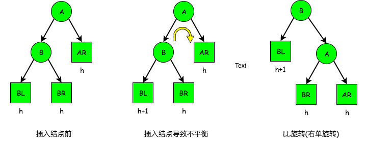
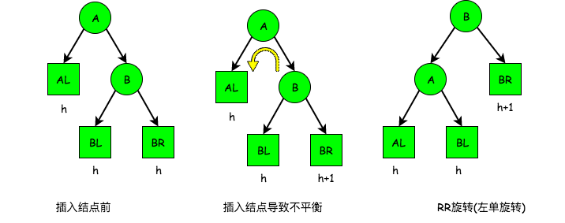
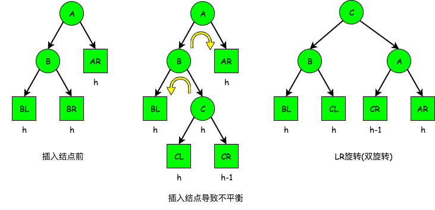
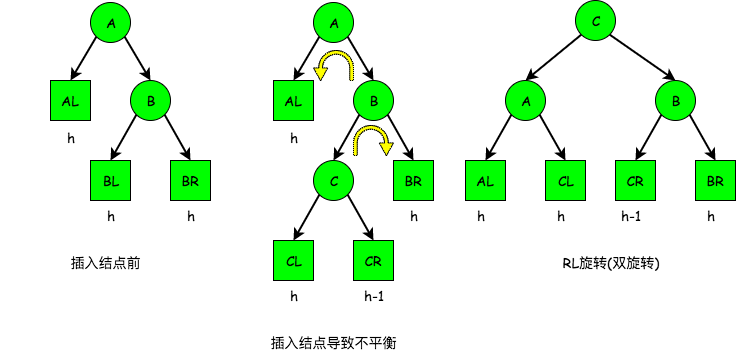
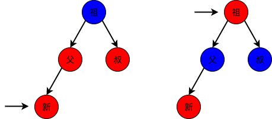
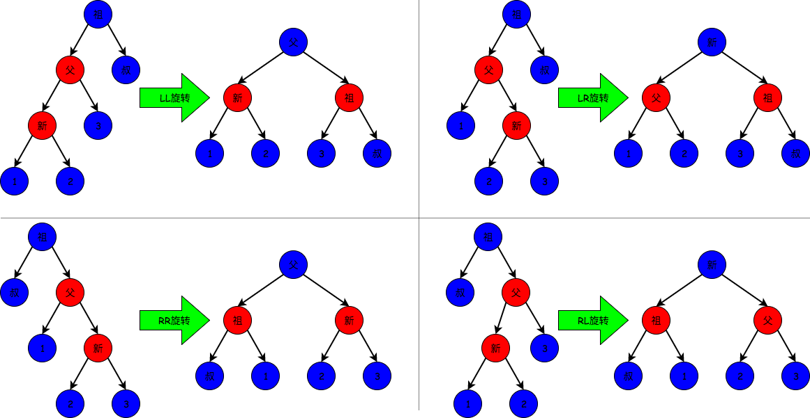

经常见到的树有: `BST二叉排序树`, `AVL平衡二叉树`, `B树`, `B-树`, `B+树`, `B*树`, `RBT红黑树`

## BST树
二叉排序树, 也称二叉查找树(`Binary Search Tree`), 简称`BST`.

### 定义
二叉排序树或者是一棵空树, 或者是一棵具有下列特性的非空二叉树:

* 若左子树非空, 则左子树上所有结点关键字值均小于根结点的关键字值
* 若右子树非空, 则右子树上所有结点关键字值均大于根结点的关键字值
* 左右子树本身也分别是一颗二叉排序树

### 示例
下图中左右两个都是二叉排序树

### 二叉排序树的查找

从根结点开始进行关键字比较, 若相等, 则查找成功; 若不等, 如果查找的关键字小于根结点关键字, 去左子树中查找, 否则去右子树中查找. 若最后不再有子树, 查找失败.

## 二叉排序树的插入

与查找过程类似, 若待插入的`BST`树为空, 则直接插入; 若关键字`k`小于根结点关键字, 则插入到左子树, 否则插入到右子树

### 二叉排序树的删除
删除操作可以按下面情况处理

1. 若被删结点`z`是叶子结点, 则直接删除, 不会破坏二叉排序树的性质
2. 若`z`只有一颗子树, 则让`z`的子树成为`z`父节点的子树, 即替代`z`的位置
3. 若`z`有左右两棵子树, 则令`z`的直接前驱(即`z`左子树中最大的那个结点)替代`z`, 再从左子树中删除这个直接前驱, 这样就转化成了第一或第二中情况(因为`z`的直接前驱, 肯定没有右子树)

## AVL平衡二叉树

`平衡二叉树`的发明者为`Georgy Adelson-Velsky`和`Evgenii Landis`, 所以也被称作`AVL树`. 在维基百科[AVL树的定义](https://en.wikipedia.org/wiki/AVL_tree)中有这么一句话: `In computer science, an AVL tree is a self-balancing binary search tree.`, 所以`AVL平衡二叉树`是`BST二叉搜索树`的子集.

### 定义
平衡二叉树或者是一棵空树, 或者是一棵具有下列特性的非空二叉树:

* 它的左右子树高度差绝对值不超过1
* 它的左右子树都是平衡二叉树

虽然`AVL平衡二叉树`的定义中并没有体现它是一个排序树, 但它是以`二叉排序树`为前提的

### 平衡二叉树的插入
`二叉排序树`插入时, 只需要保证排序的特性, `平衡二叉树`的插入同时还需要保证插入结点之后仍然平衡.  
`平衡二叉树`的插入过程前半部分与`二叉排序树`相同, 但在新结点插入后, 如果破坏了某个结点的平衡, 则需要作出相应的调整. 一般可将失去平衡后进行调整的规律归纳为下列4种情况:

* `LL平衡旋转`(`右单旋转`)。在结点`A`的左孩子(`L`)的左子树(`L`)上插入新结点, 导致以`A`为根的子树失去平衡, 此时需要做一次向右的旋转操作。将`A`的左孩子`B`向右上旋转代替`A`成为根结点, 将`A`结点向右下旋转成为`B`的右子树的根结点, 而`B`的原右子树则成为`A`的左子树。 过程如下图:

* `RR平衡旋转`(`左单旋转`)。在结点`A`的右孩子(`R`)的右子树(`R`)上插入新结点, 导致以`A`为根的子树失去平衡, 此时需要做一次向左的旋转操作。将`A`的右孩子`B`向左上旋转代替`A`成为根结点, 将`A`结点向左下旋转成为`B`的左子树的根结点, 而`B`的原左子树则成为`A`的右子树。 过程如下图:

* `LR平衡旋转`(`先左后右双旋转`)。在结点`A`的左孩子(`L`)的右子树(`R`)上插入新结点, 导致以`A`为根的子树失去平衡, 此时需要做两次旋转操作, 先左旋转后右旋转。将`A`的左孩子`B`的右子树的根结点`C`向左上旋转提升到`B`结点的位置, 然后再把`C`结点向右上旋转提升到`A`结点的位置。 过程如下图:

* `RL平衡旋转`(`先右后左双旋转`)。在结点`A`的右孩子(`R`)的左子树(`L`)上插入新结点, 导致以`A`为根的子树失去平衡, 此时需要做两次旋转操作, 先右旋转后左旋转。将`A`的右孩子`B`的左子树的根结点`C`向右上旋转提升到`B`结点的位置, 然后再把`C`结点向左上旋转提升到`A`结点的位置。 过程如下图:

* `注意`, 在`LR`和`RL`旋转时, 究竟新结点插入在`C`的左子树还是右子树上, 不影响旋转过程。

### 平衡二叉树的删除
`AVL`的删除过程前半部分与`BST`相同, 但删除结点后, 如果破坏了父结点的平衡, 则需要作出相应的调整, 调整方法与插入时的调整方法一样

## RBT红黑树
红黑树(`Red Black Tree`)也是一种`二叉查找树`, 但在每个结点上增加一个存储位表示结点的颜色(`Red`或`Black`), 通过对每个结点着色, 使它满足一些性质, 这些性质共同来保证红黑树是基本上平衡的.  

`AVL`是严格平衡树, 因此在增加或者删除节点的时候, 根据不同情况, 旋转的次数比红黑树要多;  
`RBT`是弱平衡的, 用非严格的平衡来换取增删节点时候旋转次数的降低;  
所以简单说, 若搜索的次数远远大于插入和删除时, 选择`AVL树`; 若搜索、插入、删除次数几乎差不多, 应该选择`红黑树`

### RBT的性质
红黑树是每个结点都带有颜色属性的`二叉查找树`。 此外, 对于任何有效的红黑树必须满足以下特点:

1. 结点是红色或黑色
2. 根结点是黑色
3. 每个叶结点(空结点`NULL`)是黑色的
4. 每个红色结点的两个子结点都是黑色(从每个叶子到根的所有路径上不能有两个连续的红色结点)
5. 从任一结点到其每个叶子的所有路径都包含相同数目的黑色结点

这些特点共同限制了红黑树的关键性质: 从根到叶子的最长路径不多于最短路径的两倍长。这就保证了这个树大致上是平衡的。

* 这些性质如何保证最长路径不多于最短路径的两倍长?

`性质5`保证根结点到叶结点的所有路径都有相同数目的黑色结点;  
`性质2`和`性质3`保证最长路径(从根开始)两头都是黑色的;  
`性质4`保证了路径不能有两个相连的红色结点, 最短路径都是黑色结点, 最长路径有交替的红色和黑色结点;  
这就表明了没有路径能多于其他路径的两倍长

### RBT示例

### 红黑树的插入
在对红黑树进行插入操作时, 我们一般总是插入 **红色** 的结点。因为插入黑结点会增加某条路径上黑结点的数目, 从而导致整棵树黑高度的不平衡。  
当插入红色结点时, 如果插入的结点是根结点, 会破坏`性质2`; 如果插入结点的父结点是红色, 则会破坏`性质4`, 这时就需要对红黑树做一些调整。所有可能的情况有4种:

* `情况1`: 插入的是根结点(`空树`)。

此时违反`性质2`, 直接把新结点改成黑色即可。

* `情况2`: 插入的结点的父结点是黑色(`黑父`)。

此时不会违反任何性质, 红黑树没有被破坏。

* `情况3`: 父结点是红色(`红父`)。

若父结点为红色, 祖父结点必定为黑色, 否则就不是红黑树了。`红父`这种情况破坏了`性质3`, 需要调整, 需要根据叔父结点(祖父的另一个孩子)的颜色来决定做什么样的操作, 这又分两种情况

* `3.1`: 叔父结点为红色(`红父红叔`)
`红父红叔`这种情况, 如下图所示, 无需旋转, 只要将父和叔结点变为黑色, 将祖父结点变为红色即可。  
但由于祖父结点的父结点有可能为红色, 从而违反红黑树性质, 此时必须将祖父结点作为新的判定点继续向上进行平衡操作。  

**注意** 这种情况, 无论`红叔`是在左边还是在右边, 操作都是一样的。

* `3.2`: 叔父结点为黑色(`红父黑叔`)
`红父黑叔`这种情况, 需要进行旋转, 有`LL, LR, RR, RL`等情况, 旋转方式与`AVL`类似。如图:

**注意** 当旋转完成后, 就已经是红黑树了, 此时不需要再向上调整; 上面四张图的`叔、1、2、3`结点有可能为黑哨兵(`NULL`)结点。

### 红黑树的删除
红黑树本身是一棵二叉查找树, 它的删除和二叉查找树的删除类似。根据前面`BST`的删除操作可知, 真正删除的结点要么没有子树(情况1), 要么只有一颗子树(情况2、3)。所以真正删除的结点 **只有一个孩子** 或 **没有孩子**。 再结合`红黑树`的特点, 可以得出以下两个结论:

1. 真正被删除的必定是没有孩子的结点或只有一个红色孩子的结点
2. 如果真正删除的结点是一个红色结点, 那么它必定是一个叶子结点

根据这两个重要结论, 删除操作有以下情况:(`旧点`表示真正要删除的结点, `新点`表示旧结点的孩子结点)

* `1.`旧点为红色: 根据`结论2`, 若`旧点`(真正要删除的结点)为红色, 则它必是叶子结点, 这种情况直接删除即可.

* `2.`一红一黑: 若`旧点`为黑色, `新点`为红色时, `新点`取代`旧点`位置后, 将`新点`染黑即可

* `3.`双黑: 当`旧点`和`新点`都为黑色时(`新点`为`NULL`时, 也属于这种情况), 情况比较复杂, 需要根据`旧点`兄弟结点的颜色来决定进行什么样的操作, 兄弟结点又分`红兄`和`黑兄`两种情况。情况略复杂, 具体可以参考[这篇文章](http://blog.csdn.net/very_2/article/details/5722682)

## B树,B-树,B+树

`B树`又称`多路平衡查找树`或`多路平衡查找树`, 英文为`B-Tree`有的翻译成`B树`, 有的翻译为`B-树`, 两者是同一个东西.

关于`B树`和`B+树`, [查找算法](2017-05-14-查找算法.html)中已有详细介绍.
