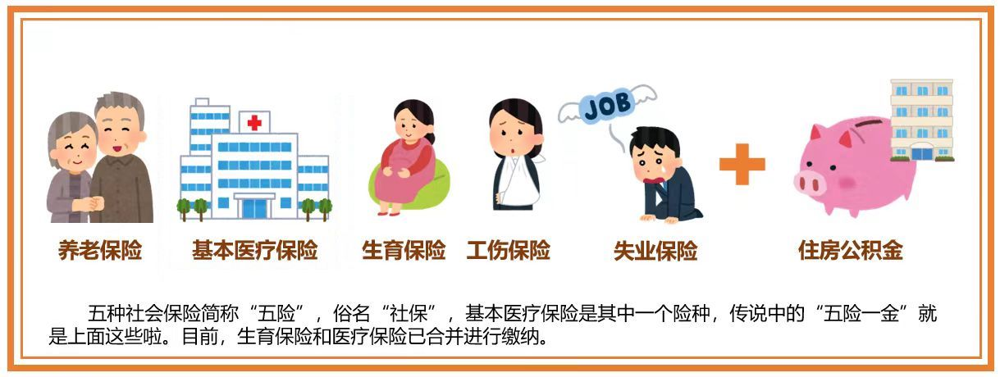
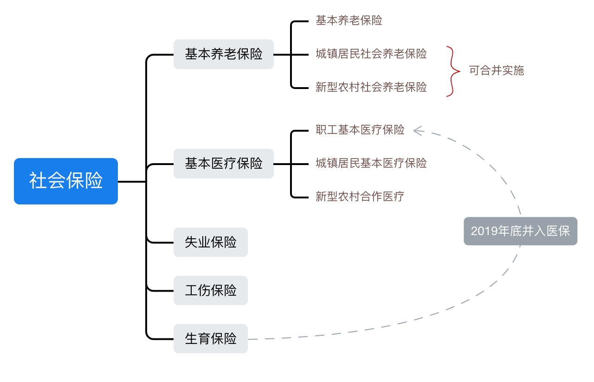
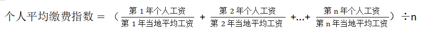
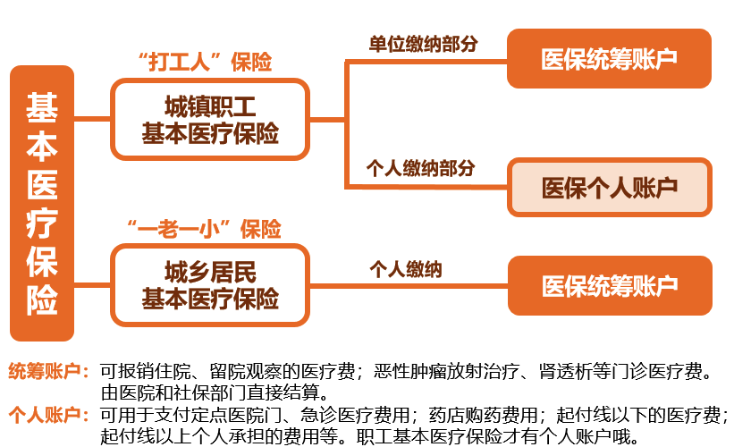
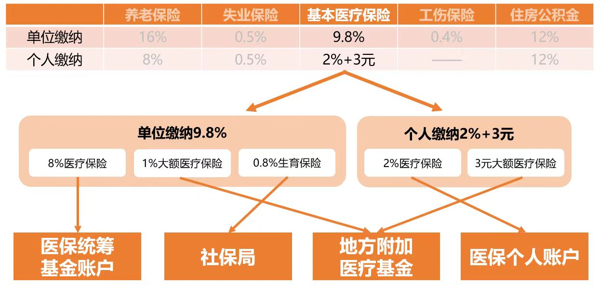

## 五险一金

平时所说的**五险一金**即**社保公积金**。

社保，指的是**社会保险**，通常包含**养老、医疗、失业、工伤、生育**等五项保险，俗称“五险”。

公积金，指的是**住房公积金**，俗称“一金”。

[《劳动法》](https://flk.npc.gov.cn/detail2.html?ZmY4MDgwODE2ZjEzNWY0NjAxNmYyMGYxNmVlMTE3Mzc%3D)第七十二条规定，`用人单位和劳动者必须依法参加社会保险，缴纳社会保险费。`

公积金以前并不是必须缴纳的，但在2020年[《住房公积金管理条例》](https://flk.npc.gov.cn/detail2.html?ZmY4MDgwODE2ZjNjYmIzYzAxNmY0MGZjN2I2ODBmZjI%3D)新规中，公积金也必须缴纳了。

因此社保和公积金，用人单位都**必须缴纳**。

## 社保包含什么

[《社会保险法》](https://flk.npc.gov.cn/detail2.html?ZmY4MDgwODE2ZjEzNWY0NjAxNmYyMTA5ODliOTE3OWE%3D)第二条规定，`国家建立基本养老保险、基本医疗保险、工伤保险、失业保险、生育保险等社会保险制度`。

对于有工作的公司**职工**，养老、医疗、失业、工伤、生育这五险都是必须缴纳的，其中工伤、生育这两项，由用人单位缴纳，职工不缴纳。
职工的养老、医疗保险一般称为职工养老保险、职工医疗保险。

对于无工作的**居民**（包括城镇居民和农村居民），只参加养老、医疗两险，一般称为居民养老保险、居民医疗保险+新农合。

注：2019年底，生育保险并入职工基本医疗保险

> 国务院办公厅[《关于全面推进生育保险和职工基本医疗保险合并实施的意见》](https://www.gov.cn/zhengce/content/2019-03/25/content_5376559.htm)

## 缴费比例

**不同地方缴费比例不同，同一地方也会有所调整**，2024年北京社保缴费比例:  

|       分类       | 单位缴纳     | 个人缴纳   |
| :--------------: | :----------- | :--------- |
|     养老保险     | `16%`        | `8%`       |
| 医疗(含生育)保险 | `9.8%`       | `2% + 3元` |
|     失业保险     | `0.5%`       | `0.5%`     |
|     工伤保险     | `0.2%～1.9%` | `0%`       |
|    住房公积金    | `12%`        | `12%`      |

单位总共缴纳缴费基数的 `38.5%`, 个人共缴纳`22.5% + 3元`。

> 北京人社局 [《北京市历年养老、失业、工伤保险缴费基数上下限、缴费比例一览表》](https://rsj.beijing.gov.cn/bm/ywml/202308/t20230804_3214781.html)  
> 北京人社局[《关于降低本市社会保险费率的通知》](https://rsj.beijing.gov.cn/xxgk/2024zcwj/202406/t20240617_3716831.html)  
> 北京医保局 [《关于调整本市城镇职工基本医疗保险缴费比例的通知》](https://ybj.beijing.gov.cn/zwgk/2024zcwj/202406/t20240617_3716990.html)

举例说明，老王在北京上班，工资`10000元/月`，那么公司除了发的10000元工资外，还需给他交`3850元`的五险一金(单位缴纳缴纳部分)；  
他这10000元工资，其中有`2250+3=2253`元用来交五险一金(个人缴纳部分)，剩下的钱属于应纳税收入，按照个人所得税交完税后才是拿到手的钱。

## 缴费基数
五险一金的缴费比例都有一个缴费基数。

### 决定因素
缴费基数是由**社保缴费基数**决定的。 一般来说，缴费基数是上一年社会月均工资的60%至300%区间内。

> 北京市人力资源和社会保障局发布的 [《关于进一步统一各项社会保险缴费基数的通知》](https://rsj.beijing.gov.cn/xxgk/zcwj/202312/t20231228_3517338.html)中规定：
> 
> 一、在确定单位及职工参加社会保险的缴费基数时，各项社会保险缴费基数统一按被保险人上一年度月平均工资确定
> 
> 二、被保险人缴费基数的上限为本市上一年职工月平均工资的300％，下限为本市上一年职工月平均工资的60％。

### 上下限
第一条表明：缴费基数跟个人上年月平均工资有关 (**个人工资**)   
第二条表明：缴费基数跟本市上年月平均工资有关 (**社会平均工资**)  
总体来看，缴费基数介于社会平均工资的60%~300%之间  
::: tip 如果你的工资
* **低于**社会平均工资的`60%`，则缴费基数为上年**社会月平均工资的60%**;
* **介于**社会平均工资的`[60%, 300%]`**之间**，则缴费基数就是**你自己上一年月平均工资**;
* **高于**社会平均工资的`300%`，则缴费基数为上年**社会月平均工资的300%**
:::

### 社会平均工资
社会月平均工资每个城市不一样，一般是由人力资源和社会保障局根据上一年的情况计算得出，每年大概七月份会更新社保缴费基数。

> 北京市人力资源和社会保障局：[《历年北京市全口径城镇单位就业人员平均工资》](https://rsj.beijing.gov.cn/bm/ywml/202007/t20200717_1950961.html)
> 
> 北京市人力资源和社会保障局：[《关于统一2023年度各项社会保险缴费工资基数上下限的通告》](https://rsj.beijing.gov.cn/xxgk/zcwj/202307/t20230727_3208224.html)。
> 
2022年的社会月平均工资为`11297元`，2023年7月更新的社保缴费基数上限为`33891元`，下限为`6326元`。

## 养老保险
养老保险简单来说就是退休后可按月领取基本养老金。

**基本养老金**由统筹养老金和个人账户养老金组成。
单位缴纳部分记入**统筹基金**，个人缴纳部分记录**个人账户**。
个人账户余额可以继承。

### 谁来交？
养老保险费由用人单位和个人共同缴纳。

### 如何领？
无论是职工养老，还是居民养老，累计交满**15年**，**退休后**可以按月领取**基本养老金**。

### 领多少？
这里只以城镇职工基本养老保险为例介绍退休后领取的养老金的计算方法。

依据[《国务院关于完善企业职工基本养老保险制度的决定》](https://www.gov.cn/zhengce/content/2008-03/28/content_7376.htm)，2006年全国统一改革基本养老金计发办法，退休后的基本养老金由3部分组成：

`基本养老金` = `统筹养老金` + `个人账户养老金` + `过渡性养老金`

* 过渡性养老金

养老保险制度建立之前的情况，1996年之前参加工作的人会涉及。由于我们这代人不涉及过渡性养老金，所以不用考虑。

* 个人账户养老金

::: tip 个人账户养老金计算方法
$$
\text{个人账户养老金} = \text{个人账户储存额} \div \text{计发月数}
$$
> `个人账户储存额`：主要是个人缴纳的那部分钱及其利息。  
> `计发月数`：根据平均寿命计算，50岁退休按195个月，55岁退休按170个月，60岁退休按139个月。

:::

如老王正常60岁退休，每个月的养老金中`个人账户养老金`部分的钱数为：`个人账户储存额` ÷ `139`

* 统筹养老金

**统筹养老金**也叫**基础养老金**

<!-- `基础养老金` = `(P + P × i ) ÷ 2 × n × 1%` = `P × (1 + i）÷ 2 × n × 1%` -->

::: tip 统筹养老金计算方法
$$
\text{统筹养老金} = \text{基础养老金} = \frac {P + P \times i} 2 × n\% = P × \frac {1 + i} 2 × n\%
$$
> `P`：退休上年度当地在岗职工月平均工资  
> `i`：本人历年缴费指数的平均值（缴费指数=本人缴费工资基数÷社会平均工资）  
> `n`：本人累计缴费年限  
:::

对于`i`平均缴费指数算法如下：

<!--  -->

$$
\text{平均缴费指} = \left(\sum_{i=1}^n \frac {\text{第i年本人工资}} {\text{第i年社会平均工资}} \right) \div n
$$

若本人缴费基数=社会平均工资，则每年的缴费指数为1，平均缴费指数`i=1`。

所以一个人缴费基数越高，缴费年限越长，领的越多。同时，因为是终生领取，所以活得越久领得越多。

另外基础养老金中对于年龄65~80等不同年龄的退休人员有几十块的增发部分，称为基础养老金增发部分。

> 参考文章：[养老金如何计算？](https://mp.weixin.qq.com/s/FmNN0IYWdkmzvpDs-6xeaA)

## 医疗保险
基本医疗保险又分为`城镇职工基本医疗保险`和`城乡居民基本医疗保险`，是人们生活中最重要和最基础的医疗保障，也是我们平时接触最多的医疗保险。

### 城镇职工基本医疗保险
简单来说，城镇职工基本医疗保险的对象是有工作单位的“打工人”。医疗保险费由用人单位和个人共同缴纳。

医疗保险累计缴费达到国家规定年限的，退休后可终生享受医疗保险待遇。  
各地没有统一规定，北京、天津、青岛是女20年，男25年；上海、广州是15年，杭州是20年；深圳今年21年，未来将延长到25年。

城镇职工基本医疗保险实行社会统筹医疗基金与个人医疗帐户相结合的基本模式，通俗一点说，“打工人”的医保费用将会缴纳进入两个账户，即`统筹账户`和`个人账户`。

* `统筹账户`：单位缴纳的费用全部进入统筹账户，当地医保部门统一管理这部分资金。我们常说的报销主要使用的就是这里的钱，这也是医保真正发挥作用的地方。通常我们接触不到统筹账户，等门诊或住院需要报销时，会由医院和社保部门直接结算。
* `个人账户`：个人缴纳部分（基数×2％）划入个人帐户，主要用于医保报销之外的小额费用支出，如普通门诊看病、买药、医保报销后的个人自付部分等。个人账户的本金和利息归个人所有，但只能专款专用，用于医疗费用支出。  

> 延伸阅读：[医保个人账户中的资金还可以取出来吗？](https://mp.weixin.qq.com/s?__biz=MzI2NDcxNzYzMg==&mid=2247671569&idx=4&sn=59a552defd2aab4a7239ead9a4b6339a&chksm=eaa44b3eddd3c2289418f8af06c5d1a07d6c5eb0b53484969df3e0c4599f019aaf888194a1b3&scene=27)

### 城乡居民基本医疗保险
未成年儿童、在校学生、老人怎么办？  
没有单位的城乡居民基本医疗保险所面对的参保人不仅限于“一老一小”，在劳动年龄内且无参加其他基本医疗保险的人群也是其参保对象。不过，居民基本医疗保险就只有统筹账户，缴纳一年费用享受一年保障待遇。

> 参考文章：[医保那些事儿](https://mp.weixin.qq.com/s?__biz=MzU5MzU0NTM1Mg==&mid=2247486780&idx=1&sn=ce408decd203d4912eca348b69b88d8b&chksm=fe0f9cdbc97815cdc3f0ad114ac279a75ec05c228d4cc278e78862456a0246084c6d9c809a15&token=375433299&lang=zh_CN&scene=21#wechat_redirect)

### 医保报销
关于医保报销，甲类乙类药物的报销比例不一样，门诊和住院也不一样，还有起付线封顶线等，情况略复杂，会专门写篇文章介绍医保的报销。

## 失业保险
失业保险的主要作用就是失业后可以领失业保险金

### 谁来交？
失业保险费由用人单位和个人共同缴纳。

### 如何领？
非本人意愿失业、累计缴费满一年、登记并有求职意愿才可以领取失业金。

> [《社会保险法》](https://flk.npc.gov.cn/detail2.html?ZmY4MDgwODE2ZjEzNWY0NjAxNmYyMTA5ODliOTE3OWE%3D)  
> 第四十五条　失业人员符合下列条件的，从失业保险基金中领取失业保险金：  
> （一）失业前用人单位和本人已经缴纳失业保险费满一年的；  
> （二）非因本人意愿中断就业的；  
> （三）已经进行失业登记，并有求职要求的。

### 领多久？
累计缴满一年才能享受，满1年不足5年，最长领个12月；满5年不足10年，最长领18个月；满10年及以上最长领24个月。同一个人最多领24个月。  

> [《失业保险条例》](https://flk.npc.gov.cn/detail2.html?ZmY4MDgwODE2ZjNjYmIzYzAxNmY0MGY4OTcxZjBlZjM%3D)

## 工伤保险

### 谁来交？
工伤保险费由单位缴纳，个人不用缴纳。  
如果单位未依法缴纳，发生工伤事故的，由用人单位支付工伤保险待遇。用人单位不支付的，从工伤保险基金中先行支付。  

### 怎么算工伤？
在工作期间、工作场所发生事故，或在**上下班途中**，受到非本人主要责任的交通事故都算工伤。  
> 具体情况参考：[《工伤保险条例》](https://flk.npc.gov.cn/detail2.html?ZmY4MDgwODE2ZjNjYmIzYzAxNmY0MGQ1YmMwZjA2NTk%3D)

发生工伤一定要做工伤认定。  
所在单位应当自事故发生30日内向统筹地区社会保险行政部门提出工伤认定申请。  
单位未按规定提出工伤认定申请的，工伤职工或者其近亲在1年内，可以向社会保险行政部门提出工伤认定申请。

### 有哪些保障？
发生工伤先认定，各种保障非常多。
* `单位支付`的包括：治疗期间的工资、按月领取的伤残津贴、解除劳动合同时的一次性伤残就业补助金。
* `工伤保险基金支付`的包括：医疗费、康复费、住院伙食费、外地就医交通食宿费、伤残辅助器具费用、护理费、按月领取的伤残津贴、终止劳动合同时的一次性医疗补助金、丧葬金、抚恤金、死亡补助金、劳动能力鉴定费。

## 生育保险
生育保险可以报销生孩子的医疗费用，还能在休产假时领一笔津贴。  
男性缴纳生育保险，可以为没有参加生育保险的配偶报销生育医疗费。  

生育保险目前已经并入职工医保，待遇、缴费不变，合并后报销的流程更简化，产前检查费用和普通医疗费用一同报销。（原来医疗和生育报销不是一个系统）

> 国务院办公厅[《关于全面推进生育保险和职工基本医疗保险合并实施的意见》](https://www.gov.cn/zhengce/content/2019-03/25/content_5376559.htm)

### 谁来交？
生育保险费由用人单位缴纳，个人不缴纳。  

### 使用条件？
要累计交满一定期限，各地政策不同，如北京市要求连续缴纳社保9个月，广州市要求累计缴纳社保1年，上海市要求生产当月在缴纳社保即可；

### 有哪些好处？

生育保险待遇包括`生育津贴`和`生育医疗费用`。  

生育津贴：按照职工所在用人单位上年度职工月平均工资计发。一般为`单位上年度职工月平均工资 ÷ 30 × 产假天数`。  
生育医疗费用：包括医疗检查费、接生费、手术费、住院费和药品费。医保范围内的费用报销比例一般是100%。 

> [《女职工劳动保护特别规定》](https://flk.npc.gov.cn/detail2.html?ZmY4MDgwODE2ZjNjYmIzYzAxNmY0MTBmMWVkNTE0NTE%3D)
> 
> [《北京市企业职工生育保险规定》](https://www.beijing.gov.cn/zhengce/zhengcefagui/201905/t20190522_56691.html)

*****

## 住房公积金
住房公积金不属于社保，但也是一项重要的福利

### 谁来交？
公司和个人都要交，且 职工和单位住房公积金的缴存比例均不得低于职工上一年度月平均工资的5%。  
一般是个人和公司各交一半，缴费比例在5% ~ 12%之间。

### 有什么用？
每个人只能有一个住房公积金账户，里面的钱可以用来装修、租房、买房，更重要的是可以用来做公积金贷款。  
公积金贷款比商业贷款利息低的多。贷款额度一般有上限。

[《住房公积金管理条例》](https://flk.npc.gov.cn/detail2.html?ZmY4MDgwODE2ZjNjYmIzYzAxNmY0MGZjN2I2ODBmZjI%3D)
