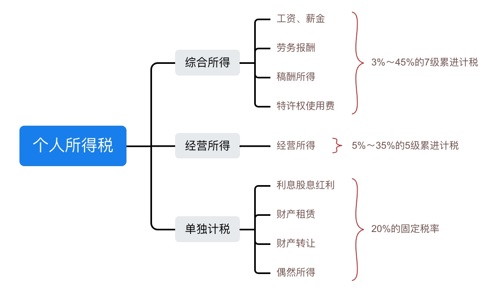

我国的税收一共18种，本文只介绍个人所得税。  
个人所得税：唯一以自然人为维度缴纳的税种，中国人在全世界范围内的收入都要纳税。

## 个人所得税

[《个人所得税法》](https://flk.npc.gov.cn/detail2.html?MmM5MDlmZGQ2NzhiZjE3OTAxNjc4YmY3MjRiZDA2MDk%3D)规定，下列各项个人所得，应当缴纳个人所得税：  
>（一）工资、薪金所得；  
>（二）劳务报酬所得；  
>（三）稿酬所得；  
>（四）特许权使用费所得；  
>（五）经营所得；  
>（六）利息、股息、红利所得；  
>（七）财产租赁所得；  
>（八）财产转让所得；  
>（九）偶然所得。  

## 个人所得税的税率

工资薪金、劳务报酬、稿酬所得和特许权使用费这四项收入称为个人综合所得。`每年收入额`减除费用`六万元`以及`专项扣除`、`专项附加扣除`和依法确定的`其他扣除`后的余额，为应纳税所得额。适用七级累进税率表。

## 应纳税所得额
收入并不是都需要交税，会有一些政策减免不用交税，而需要交税的那部分钱通常称为应纳税所得额。

* 工资薪金：`月收入-5000元`后的余额为应纳税所得额。(即每年减6万)。适用七级累进税率征税。
* 劳务报酬：个人商演、自媒体副业、兼职等收入一般归入此列。每次收入不超过4000的以`收入-800`为应纳税所得额，超过4000的以`收入×(1－20%)`为应纳税所得额。适用七级累进税率征税。
* 稿酬所得：文章、图书发表或出版等取得的收入。`收入×(1－20%)*70%`为应纳税所得额。适用七级累进税率征税。
* 特许权使用费：个人因提供专利、商标使用权获得的收入。`收入×(1－20%)`为应纳税所得额。适用七级累进税率征税。
* 经营所得：个体工商户经营、劳动等取得的收入。适用五级累进税率征税。
* 利息、股息、红利所得：股票分红、存款利息等收入。收入额为应纳税所得额。按固定税率`20%`征税。
* 财产租赁：`收入×(1－20%)`为应纳税所得额。按固定税率`20%`征税。
* 财产转让：买卖房屋、交易股票等差价收入。差额为应纳税所得额。按固定税率`20%`征税。
* 偶然所得：中奖等原因取得的收入。收入额为应纳税所得额。按固定税率`20%`征税。

## 预扣预缴

综合所得都是按年征收，但是会按月或者按次预扣预缴税款。预扣预缴办法由国务院税务主管部门制定。

* 为什么每月都扣税，年底还要报税？
> 国内税收属于先扣缴后申报，工资薪金是按月预扣，但有些特殊情况，如换工作、劳务报酬等发放收入的付款单位并不清楚个人的其它收入，所以只能按照既定公式预扣税款，待自然年结束时再一起汇算清缴，多退少补。

下面是预扣率表：

### 个人所得税预扣率表一

::: tip 居民个人工资薪金所得预扣预缴适用
| 级数 | 全年应纳税所得额             | 税率(%) | 速算扣除数(元) |
| ---- | ---------------------------- | ------- | -------------- |
| 1    | 不超过36000元的              | 3%      | 0              |
| 2    | 超过36000元至144000元的部分  | 10%     | 2520           |
| 3    | 超过144000元至300000元的部分 | 20%     | 16920          |
| 4    | 超过300000元至420000元的部分 | 25%     | 31920          |
| 5    | 超过420000元至660000元的部分 | 30%     | 52920          |
| 6    | 超过660000元至960000元的部分 | 35%     | 85920          |
| 7    | 超过960000元的部分           | 45%     | 181920         |
:::

### 个人所得税预扣率表二

::: tip 居民个人劳务报酬所得预扣预缴适用
| 级数 | 全年应纳税所得额           | 税率(%) | 速算扣除数(元) |
| ---- | -------------------------- | ------- | -------------- |
| 1    | 不超过20000元的部分        | 20%     | 0              |
| 1    | 超过20000元至50000元的部分 | 30%     | 2000           |
| 2    | 超过50000元的部分          | 40%     | 7000           |
:::

## 个人所得税税率表

### 个人所得税税率表一

::: tip 综合所得适用
| 级数 | 全年应纳税所得额             | 税率(%) | 速算扣除数(元) |
| ---- | ---------------------------- | ------- | -------------- |
| 1    | 不超过36000元的              | 3%      | 0              |
| 2    | 超过36000元至144000元的部分  | 10%     | 2520           |
| 3    | 超过144000元至300000元的部分 | 20%     | 16920          |
| 4    | 超过300000元至420000元的部分 | 25%     | 31920          |
| 5    | 超过420000元至660000元的部分 | 30%     | 52920          |
| 6    | 超过660000元至960000元的部分 | 35%     | 85920          |
| 7    | 超过960000元的部分           | 45%     | 181920         |
:::

### 个人所得税税率表二

::: tip 经营所得适用
| 级数 | 全年应纳税所得额            | 税率(%) | 速算扣除数(元) |
| ---- | --------------------------- | ------- | -------------- |
| 1    | 不超过30000元的             | 5%      | 0              |
| 2    | 超过30000元至90000元的部分  | 10%     | 1500           |
| 3    | 超过90000元至300000元的部分 | 20%     | 10500          |
| 4    | 超过300000元至500000的部分  | 30%     | 40500          |
| 5    | 超过500000的部分            | 35%     | 65500          |
:::

### 个人所得税税率表三

::: tip 非居民个人工资薪金所得，劳务报酬、稿酬、特许权使用费所得适用
| 级数 | 全年应纳税所得额           | 税率(%) | 速算扣除数(元) |
| ---- | -------------------------- | ------- | -------------- |
| 1    | 不超过30000元的            | 3%      | 0              |
| 2    | 超过3000元至12000元的部分  | 10%     | 210            |
| 3    | 超过12000元至25000元的部分 | 20%     | 1410           |
| 4    | 超过25000元至35000的部分   | 25%     | 2660           |
| 5    | 超过35000元至55000元的部分 | 30%     | 4410           |
| 6    | 超过55000元至80000的部分   | 35%     | 7160           |
| 7    | 超过80000的部分            | 45%     | 15160          |
:::
