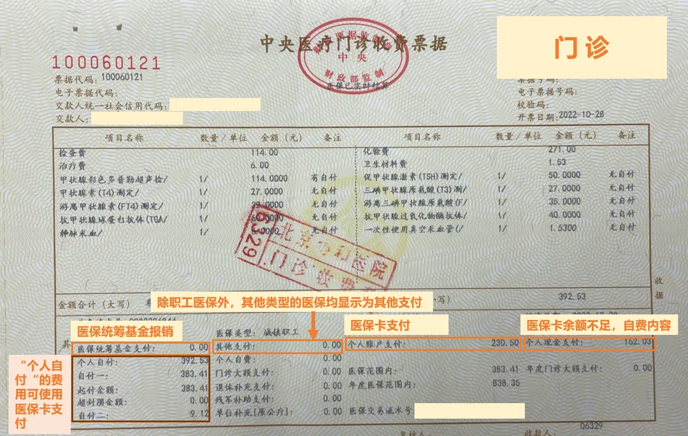
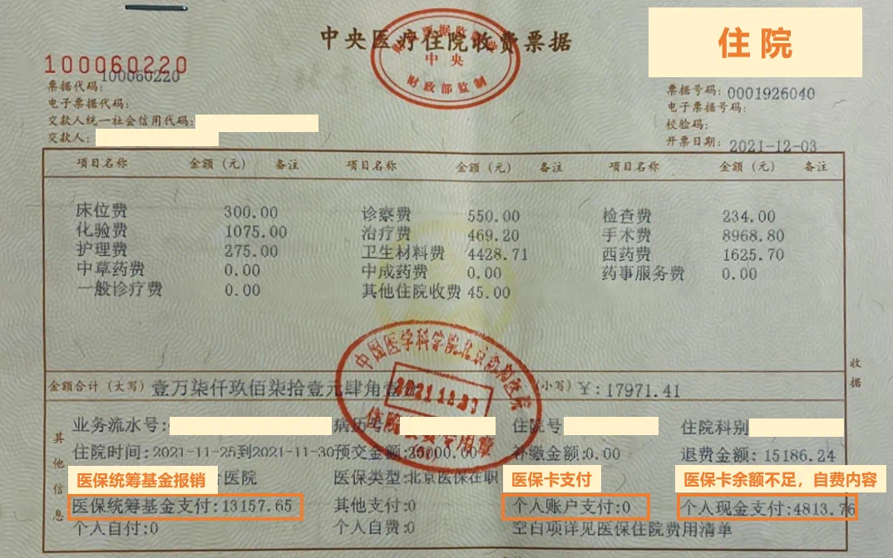
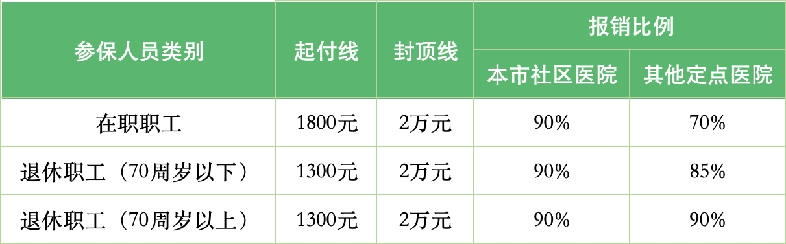
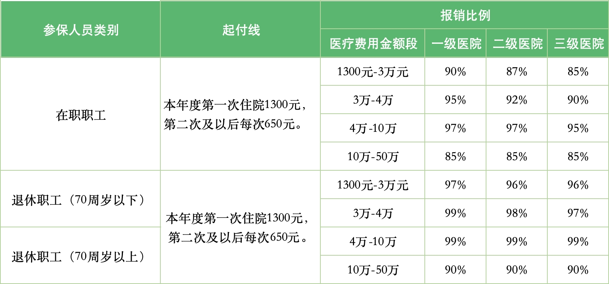
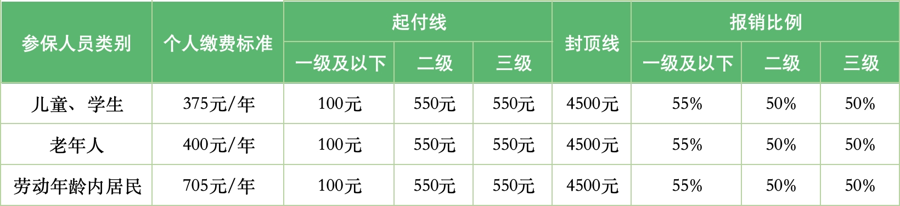
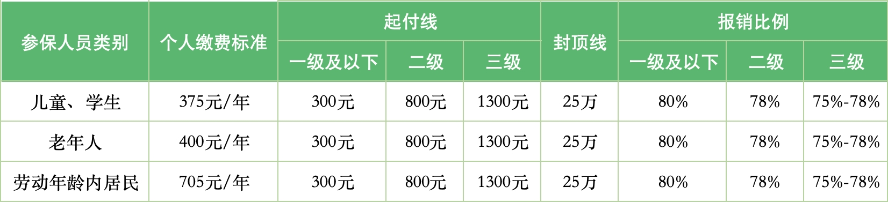

在[五险一金详解](./2024-06-20-五险一金详解)中已经对基本医疗保险有所了解，我们常说的**报销是指由医保统筹基金支付的费用**，医保部门统一管理这部分资金，在门诊或住院需要报销时，会由医院和社保部门直接结算，在支付时自动扣除。

医保报销是个十分复杂的过程，涉及到参加保险的种类(城镇职工还是城乡居民)、医院级别、医保目录等。

## 国家医保目录
医疗费用报销是有范围的，哪些费用能报？哪些不能报？这些根据国家医保目录来定。

> [《社会保险法》](https://flk.npc.gov.cn/detail2.html?ZmY4MDgwODE2ZjEzNWY0NjAxNmYyMTA5ODliOTE3OWE%3D)  
> 第二十八条　符合基本医疗保险==药品目录、诊疗项目、医疗服务设施==标准以及急诊、抢救的医疗费用，按照国家规定从基本医疗保险基金中支付。  
>
> [《关于建立医疗保障待遇清单制度的意见》](https://www.gov.cn/zhengce/zhengceku/2021-08/11/content_5630791.htm)  
> （三）基金支付范围。  
> 包括以准入法和排除法确定的药品医用耗材目录和医疗服务项目支付范围。  
> 国家统一制定国家基本医疗保险==药品目录==，各地严格按照国家基本医疗保险药品目录执行，除国家有明确规定外，不得自行制定目录或用变通的方法增加目录内药品。  
> 国家建立完善==医用耗材、医疗服务项目==医保准入、管理政策，明确确定医用耗材医保支付范围的程序、规则等。地方按照国家规定政策执行。

通常`医保三大目录`是指`医保药品目录`、`诊疗项目目录`和`医疗服务设施目录`。 其中`医保药品目录`是国家统一制定，后两项正在建立和完善(叫法和内容不完全统一，有的也叫`医用耗材目录`、`医疗服务项目目录`)

## 药品目录
医保药品目录的全称是《国家基本医疗保险、工伤保险和生育保险药品目录》，国家医保局通常每年都会对医保药品目录做一次调整。  
它将临床治疗必需、使用广泛、疗效好、价格适当的药品纳入了目录，这些就是`甲类药`和`乙类药`。还有一个因价格太高被目录拒之门外的`丙类药`。  
甲、乙、丙三类药品的详细介绍，以及如何查询药品的医保分类，请滑动以下图片进行查阅。

### 甲类药
甲类药品是指临床治疗必需、使用广泛、疗效确切、同类药品中价格或治疗费用较低的药品。  
甲类药品可以全额纳入医保报销范围，然后按医保规定的比例报销。

`甲类药品报销金额` = `药价` × `报销比例`

《2023年国家医保药品目录》中，甲类药品共有`641`个，其中西药395个，中成药246个。

### 乙类药
乙类药品是指可供临床治疗选择使用，疗效确切、同类药品中比`甲类药品`价格或治疗费用略高的药品。  
使用乙类药品时，需要先由个人自付一定比例后，将剩余部分的费用纳入医保报销范围，然后再按医保规定的比例报销。

`乙类药品报销金额` = (`药价` － `药价` × `个人先行自付比例`) × `报销比例`

《2023年国家医保药品目录》中，乙类药品共有`2447`个，其中乙类西药1303个，乙类中成药1144个。

### 丙类药
丙类药是指**医保药品目录外**的药品，是非临床必需、价格较高的药品。一般包括：保健品类、高档药、新研制的药、抗癌进口药等。

不在甲乙类药品目录中的药均属于丙类药，无法报销，属于完全自费类药品。

`丙类药品报销金额` = 0

医保目录外药品(丙类药)共有`156286`个

像靶向药、进口药、特效药等，绝大部分都不在医保药品目录内，需要自费购买。

### 药品目录查询方法

1. 微信搜索==国务院客户端==，进入小程序
2. 在==便民服务==中选择==医保药品目录==
3. 搜索要查找的药品名称(通用名称)

## 诊疗项目目录
诊疗项目是指医院救治时所使用的临床治疗、检查等项目。比如治疗费、检查费、手术费等。  
医保可支付的诊疗项目主要是一些临床诊疗必需、效果确定但费用昂贵的诊疗项目，入血液透析、骨髓移植等；  
不予支付费用的诊疗项目主要是一些非临床诊疗必需、效果不确定或属于特需医疗服务的诊疗项目，比如病历工本费、美容项目、整容项目等。

## 医疗服务设施目录
医疗服务设施目录是指定点医疗机构提供的，在接受诊断、治疗和护理过程中必须的服务设施。  
医保基金能报销的主要包括住院床位费、留观床位费等；  
不予支付的主要包括就诊转诊交通费，急救车费等。

## 医保报销费用

 
在医保报销过程除了要先了解`起付线`和`封顶线`，更需要了解三个基本概念：`医保统筹支付`、`自费`和`自付`。

### 起付线

起付线是指医保统筹基金对参保人员发生的属于政策范围内医疗费用进行补偿的计算起点，在该起点以下的医疗费用，由参保人员承担，起付标准以上的部分再由医保基金按规定、按比例报销。  
简单说，我们看病累计达到一定的费用，医保才能报。  
起付线又分为门诊起付线和住院起付线。

### 封顶线

封顶线是指医保基金的最高支付限额，也就是参保人在一个年度内累计能报销的最高额度。  

关于起付线和封顶线，全国没有统一标准，这些均由各地政府自己制定。

比如，安徽门诊报销的起付线和封顶线分别是800元和2000元。  
河南的起付线按次算，每次40元；封顶线的话，在职人员和退休人员分别是1800元和2300元。  

有的设置了起付线，没有封顶线。  
比如，北京规定在职和退休人员的起付线分别是1800元和1300元，改革后，取消了2万元的封顶线。超过封顶线部分按比例报销。  

还有的地区设置了封顶线，而没有起付线。  
比如广州，在职人员和退休人员的封顶线分别是7200元和10100元。  

### 自费费用
门诊、住院支付的医疗费用分为**医保范围外**与**医保范围内**两部分。

医保范围外的费用，就是指不在医保三大目录报销的范围内，也就是自费范围。  
这部分费用完全由个人承担。比如丙类药，它需要患者全额自己现金(微信、支付宝、银行卡)支付，不能走医保(医保统筹基金账户)，也不能刷医保卡(医保个人账户)。    
发票上显示为==个人现金支付==。

### 医保统筹支付

医保范围内的费用，又分为三个类别：`医保基金支付`、`自付一`、`自付二`。

`医保基金支付`：在医保范围内，按照政策由医保基金支付的部分，发票上显示为==医保统筹基金支付==或==附加支付==。这部分费用由医院和医保部门直接结算。

### 自付费用
`自付一`和`自付二`合计可以称为`个人自付`，可刷医保卡。发票上显示为==个人自付==。

`自付一`：也叫个人自负，在医保结范围内，报销比例之外的部分。如：起付线以下、封顶线以上的费用，中间报销比例之外的由个人自负的费用。发票上显示为==自付一==。

`自付二`：也叫分类自负，在医保结范围内，个人先行自付部分。比如乙类药品个人要先行自付10%-30%。发票上显示为==自付二==。

* 注意：这里个人自负和分类自负的负并非错别字，在医疗保险领域，自负和自付是两个不同的概念。

## 二次报销
二次报销指的是报销`个人自付`的医疗费用，即医保范围内，但医保没报销的部分。它是基本医疗保险制度的扩展和延伸，一般补充医疗保险可报销次部分费用。

## 发票费用示例

::: tabs
@tab 门诊发票

@tab 住院发票

:::

## 医保待遇标准

我们可以看到，基本医疗保险具有`广覆盖，低水平`、`可带病参保`的特点。各地的待遇标准可到社保局、医保局等官方网站进行查询。  
以下是北京市医保待遇标准，仅供参考。

::: tabs
@tab 城镇职工医保(门诊)

@tab 城镇职工医保(住院)

@tab 城乡居民医保(门诊)

@tab 城乡居民医保(住院)

:::
