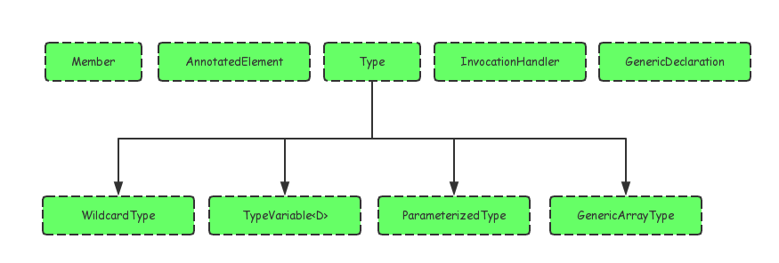

本文主要介绍java中`Type`接口的来历以及相关的几个接口。  
通过这边文章，我们可以了解到与范型相关的几个接口, 对范型的分类有个了解;  
还可以了解到`Type`接口与`Class`类的关系, 以及`Type`出现的原因.  


*****

## 反射相关接口


下面就把`Type`的来龙去脉彻底弄清楚

## Type
`Type`是所有类型的父接口, 如原始类型(raw types,对应Class)、 参数化类型(parameterized types, 对应ParameterizedType)、 数组类型(array types,对应GenericArrayType)、 类型变量(type variables, 对应TypeVariable)和基本(原生)类型(primitive types, 对应Class), 子接口有`ParameterizedType, TypeVariable<D>, GenericArrayType, WildcardType`, 实现类有`Class`

## ParameterizedType
具体的范型类型, 如`Map<String, String>`  
有如下方法:

1. `Type getRawType()`: 返回承载该泛型信息的对象, 如上面那个`Map<String, String>`承载范型信息的对象是`Map`
2. `Type[] getActualTypeArguments()`: 返回实际泛型类型列表, 如上面那个`Map<String, String>`实际范型列表中有两个元素, 都是`String`
3. `Type getOwnerType()`: 返回是谁的member.(上面那两个最常用)

```java
public class TestType {
    Map<String, String> map;
    public static void main(String[] args) throws Exception {
        Field f = TestType.class.getDeclaredField("map");
        System.out.println(f.getGenericType());                               // java.util.Map<java.lang.String, java.lang.String>
        System.out.println(f.getGenericType() instanceof ParameterizedType);  // true
        ParameterizedType pType = (ParameterizedType) f.getGenericType();
        System.out.println(pType.getRawType());                               // interface java.util.Map
        for (Type type : pType.getActualTypeArguments()) {
            System.out.println(type);                                         // 打印两遍: class java.lang.String
        }
        System.out.println(pType.getOwnerType());                             // null
    }
}
```

## TypeVariable
类型变量, 范型信息在编译时会被转换为一个特定的类型, 而`TypeVariable`就是用来反映在JVM编译该泛型前的信息.  
它的声明是这样的: `public interface TypeVariable<D extends GenericDeclaration> extends Type`  
也就是说它跟`GenericDeclaration`有一定的联系, 我是这么理解的:  
`TypeVariable`是指在`GenericDeclaration`中声明的`<T>、<C extends Collection>`这些东西中的那个变量`T、C`;
它有如下方法:

1. `Type[] getBounds()`: 获取类型变量的上边界, 若未明确声明上边界则默认为`Object`
2. `D getGenericDeclaration()`: 获取声明该类型变量实体
3. `String getName()`: 获取在源码中定义时的名字

注意:

* 类型变量在定义的时候只能使用`extends`进行(多)边界限定, 不能用`super`;
* 为什么边界是一个数组? 因为类型变量可以通过`&`进行多个上边界限定，因此上边界有多个

```java
public class TestType <K extends Comparable & Serializable, V> {
    K key;
    V value;
    public static void main(String[] args) throws Exception {
        // 获取字段的类型
        Field fk = TestType.class.getDeclaredField("key");
        Field fv = TestType.class.getDeclaredField("value");
        Assert.that(fk.getGenericType() instanceof TypeVariable, "必须为TypeVariable类型");
        Assert.that(fv.getGenericType() instanceof TypeVariable, "必须为TypeVariable类型");
        TypeVariable keyType = (TypeVariable)fk.getGenericType();
        TypeVariable valueType = (TypeVariable)fv.getGenericType();
        // getName 方法
        System.out.println(keyType.getName());                 // K
        System.out.println(valueType.getName());               // V
        // getGenericDeclaration 方法
        System.out.println(keyType.getGenericDeclaration());   // class com.test.TestType
        System.out.println(valueType.getGenericDeclaration()); // class com.test.TestType
        // getBounds 方法
        System.out.println("K 的上界:");                        // 有两个
        for (Type type : keyType.getBounds()) {                // interface java.lang.Comparable
            System.out.println(type);                          // interface java.io.Serializable
        }
        System.out.println("V 的上界:");                        // 没明确声明上界的, 默认上界是 Object
        for (Type type : valueType.getBounds()) {              // class java.lang.Object
            System.out.println(type);
        }
    }
}
```

## GenericArrayType
范型数组,组成数组的元素中有范型则实现了该接口; 它的组成元素是`ParameterizedType`或`TypeVariable`类型,它只有一个方法:

1. `Type getGenericComponentType()`: 返回数组的组成对象, 即被JVM编译后实际的对象

```java
public class TestType <T> {
    public static void main(String[] args) throws Exception {
        Method method = Test.class.getDeclaredMethods()[0];
        // public void com.test.Test.show(java.util.List[],java.lang.Object[],java.util.List,java.lang.String[],int[])
        System.out.println(method);
        Type[] types = method.getGenericParameterTypes();  // 这是 Method 中的方法
        for (Type type : types) {
            System.out.println(type instanceof GenericArrayType);
        }
    }
}
class Test<T> {
    public void show(List<String>[] pTypeArray, T[] vTypeArray, List<String> list, String[] strings, int[] ints) {
    }
}
```

* 第一个参数`List<String>[]`的组成元素`List<String>`是`ParameterizedType`类型, 打印结果为`true`
* 第二个参数`T[]`的组成元素`T`是`TypeVariable`类型, 打印结果为`true`
* 第三个参数`List<String>`不是数组, 打印结果为`false`
* 第四个参数`String[]`的组成元素`String`是普通对象, 没有范型, 打印结果为`false`
* 第五个参数`int[] pTypeArray`的组成元素`int`是原生类型, 也没有范型, 打印结果为`false`

## WildcardType
该接口表示通配符泛型, 比如`? extends Number` 和 `? super Integer`
它有如下方法:

1. `Type[] getUpperBounds()`: 获取范型变量的上界
2. `Type[] getLowerBounds()`: 获取范型变量的下界

注意:

* 现阶段通配符只接受一个上边界或下边界, 返回数组是为了以后的扩展, 实际上现在返回的数组的大小是1

```java
public class TestType {
    private List<? extends Number> a;  // // a没有下界, 取下界会抛出ArrayIndexOutOfBoundsException
    private List<? super String> b;
    public static void main(String[] args) throws Exception {
        Field fieldA = TestType.class.getDeclaredField("a");
        Field fieldB = TestType.class.getDeclaredField("b");
        // 先拿到范型类型
        Assert.that(fieldA.getGenericType() instanceof ParameterizedType, "");
        Assert.that(fieldB.getGenericType() instanceof ParameterizedType, "");
        ParameterizedType pTypeA = (ParameterizedType) fieldA.getGenericType();
        ParameterizedType pTypeB = (ParameterizedType) fieldB.getGenericType();
        // 再从范型里拿到通配符类型
        Assert.that(pTypeA.getActualTypeArguments()[0] instanceof WildcardType, "");
        Assert.that(pTypeB.getActualTypeArguments()[0] instanceof WildcardType, "");
        WildcardType wTypeA = (WildcardType) pTypeA.getActualTypeArguments()[0];
        WildcardType wTypeB = (WildcardType) pTypeB.getActualTypeArguments()[0];
        // 方法测试
        System.out.println(wTypeA.getUpperBounds()[0]);   // class java.lang.Number
        System.out.println(wTypeB.getLowerBounds()[0]);   // class java.lang.String
        // 看看通配符类型到底是什么, 打印结果为: ? extends java.lang.Number
        System.out.println(wTypeA);
    }
}
```

再写几个边界的例子:

* `List<? extends Number>`, 上界为`class java.lang.Number`, 属于`Class`类型
* `List<? extends List<T>>`, 上界为`java.util.List<T>`, 属于`ParameterizedType`类型
* `List<? extends List<String>>`, 上界为`java.util.List<java.lang.String>`, 属于`ParameterizedType`类型
* `List<? extends T>`, 上界为`T`, 属于`TypeVariable`类型
* `List<? extends T[]>`, 上界为`T[]`, 属于`GenericArrayType`类型

它们最终统一成Type作为数组的元素类型

## Type及其子接口的来历

### 泛型出现之前的类型
没有泛型的时候，只有原始类型。此时，所有的原始类型都通过字节码文件类Class类进行抽象。Class类的一个具体对象就代表一个指定的原始类型。

### 泛型出现之后的类型
泛型出现之后，扩充了数据类型。从只有原始类型扩充了参数化类型、类型变量类型、限定符类型 、泛型数组类型。

### 与泛型有关的类型不能和原始类型统一到Class的原因

* 产生泛型擦除的原因

原始类型和新产生的类型都应该统一成各自的字节码文件类型对象。但是由于泛型不是最初Java中的成分。如果真的加入了泛型，涉及到JVM指令集的修改，这是非常致命的。

* Java中如何引入泛型

为了使用泛型又不真正引入泛型，Java采用泛型擦除机制来引入泛型。Java中的泛型仅仅是给编译器javac使用的，确保数据的安全性和免去强制类型转换的麻烦。但是，一旦编译完成，所有的和泛型有关的类型全部擦除。

* Class不能表达与泛型有关的类型

因此，与泛型有关的参数化类型、类型变量类型、限定符类型 、泛型数组类型这些类型编译后全部被打回原形，在字节码文件中全部都是泛型被擦除后的原始类型，并不存在和自身类型对应的字节码文件。所以和泛型相关的新扩充进来的类型不能被统一到Class类中。

* 与泛型有关的类型在Java中的表示

为了通过反射操作这些类型以迎合实际开发的需要，Java就新增了`ParameterizedType, TypeVariable<D>, GenericArrayType, WildcardType`几种类型来代表不能被归一到Class类中的类型但是又和原始类型齐名的类型。

* 引入Type的原因

为了程序的扩展性，最终引入了Type接口作为`Class和ParameterizedType, TypeVariable<D>, GenericArrayType, WildcardType`这几种类型的总的父接口。这样可以用Type类型的参数来接受以上五种子类的实参或者返回值类型就是Type类型的参数。统一了与泛型有关的类型和原始类型Class

* Type接口中没有方法的原因

从上面看到，Type的出现仅仅起到了通过多态来达到程序扩展性提高的作用，没有其他的作用。因此Type接口的源码中没有任何方法。
