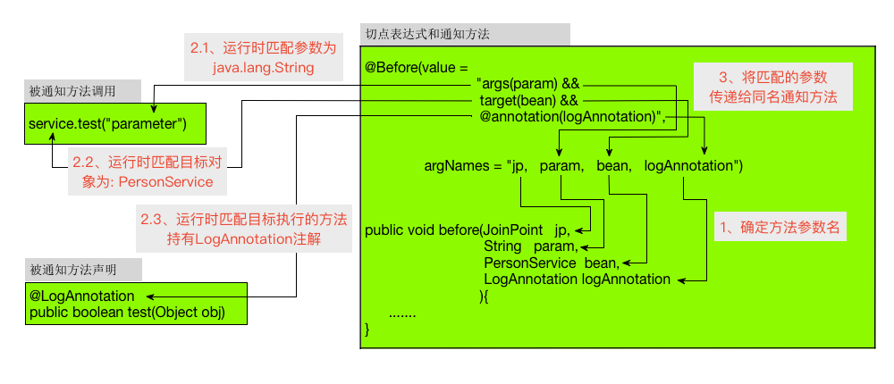

获取注解在某个方法上的注解信息


## 应用场景

通过AOP的方式, 方便的把所有方法的请求参数和返回结果都打印出来. 定义一个注解然后写切面拦截这个注解. 注解用于标记什么地方需要打日志(请求参数和返回结果).  
注解可以标记在类上, 表示该类的所有方法都需要把参数和返回值打印出来, 这样就不需要给每个方法都加注解了;  
注解也可以标记在某个具体的方法上, 表示只有这个方法要打印日志, 其他方法都不需要;  
当某类上有注解, 但这个类的某个方法不应该打日志时, 可以在这个方法上加个注解, 并给注解中的属性赋值, 表示不需要打日志.

## 注解定义

```java
@Target({ElementType.TYPE, ElementType.METHOD})
@Retention(RetentionPolicy.RUNTIME)
public @interface LogAnnotation {
    // 是否需要打印参数, 注解在方法上时该属性起作用, 注解在类上, 则忽略其值, 按照true来处理
    boolean value() default true;
}
```

加了注解的类中的方法会被AOP拦截打出日志, 不需要打印日志的方法可以通过指定`@LogAnnotation(false)` 来实现.

## 切点的定义

先写个不能达到目的的错误的例子:

```java
    @Around(value = "@annotation(com.test.LogAnnotation)")
    public Object logHandler(ProceedingJoinPoint joinPoint) throws Throwable {
        Object returnObject = null;
        LogAnnotation logAnnotation = (LogAnnotation) joinPoint.getSignature().getDeclaringType().getAnnotation(LogAnnotation.class);  
        if (logAnnotation.value()) {  
            Signature signature = joinPoint.getSignature();               // 获取切点处的方法签名
            Object[] parameters = joinPoint.getArgs();                    // 获取切点的传入参数
            logger.info("{}的请求参数为:{}", signature.toShortString(), new Gson().toJson(parameters));
            returnObject = joinPoint.proceed();
            logger.info("{}返回结果为:{}", signature.toShortString(), new Gson().toJson(returnObject));
        }
        return returnObject;
    }
```

上面这个例子不对, 因为`joinPoint.getSignature().getDeclaringType()`得到的是这个类的类型, 而不是这个方法(切点)的类型, 所以没法得到加在方法上的注解信息

或许可以这样:

```java
        JoinPoint jp;
        jp.getTarget(); //得到目标对象
        jp.getSignature().getName();//得到方法名
        jp.getArgs(); //得到方法参数
        // 通过反射拿到这个方法, 然后拿到方法上的注解
```

但是有更好的方法, 因为可以传递参数给通知方法.  
下面的代码就是可以达到目的的切面的写法:

```java
@Aspect
@Component
public class LogAspect {
    private static final Logger logger = LoggerFactory.getLogger(LogAspect.class);
    private static Gson gson = new Gson();

    /**
     * 若注解仅在类上(方法上没有), 则可通过@within拦截到, 此时通过方法没有拦截到, logParameter为null
     * 若注解在方法上, 则可以通过@annotation拦截到, 此时logParameter为方法上加的注解
     */
    @Pointcut(value = "@within(logAnnotation) || @annotation(logAnnotation)", argNames = "logAnnotation")
    public void logPointcut(LogAnnotation logAnnotation) {
    }

    @Around(value = "logPointcut(logAnnotation)")
    public Object logHandler(ProceedingJoinPoint joinPoint, LogAnnotation logAnnotation) throws Throwable {
        Object returnObject = null;
        // 方法上有注解并且指定不输出, 则不打印
        if (null != logAnnotation && Boolean.FALSE.equals(logAnnotation.value())) {
            returnObject = joinPoint.proceed();
        } else {
            Signature signature = joinPoint.getSignature();               // 获取切点处的方法签名
            Object[] parameters = joinPoint.getArgs();                    // 获取切点的传入参数
            String requestString = "void";
            // toShotString, 有参数形如 Hello.hello(..); 无参数形如: Hello.hello()
            if (signature.toShortString().contains("..")) {
                requestString = gson.toJson(parameters);
            }
            logger.info("{}的请求参数为:{}", signature.toShortString(), requestString);
            returnObject = joinPoint.proceed();
            String returnString = "void";
            // toString, 形如 void com.test.Hello.test(); String com.test.Hello.hello(String)
            if (!signature.toString().contains("void")) {
                returnString = gson.toJson(returnObject);
            }
            logger.info("{}返回结果为:{}", signature.toShortString(), returnString);
        }
        return returnObject;
    }
}
```

## 获取参数的流程解释


示例通知方法的写法:

```java
@Around(value = "args(param) && target(bean) && @annotation(logAnnotation)", argNames = "jp, param, bean, logAnnotation")
public void before(JoinPoint jp, String param, PersonService bean, LogAnnotation logAnnotation) {  
    ...
}
```

图片解释:



