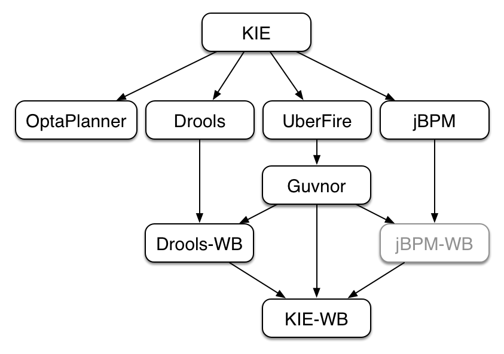

本文不涉及`Drools`的原理和介绍, 仅通过简单例子演示怎么使用`Drools`.  
另外, 各版本的文档可查看[官方资料](http://docs.jboss.org/drools/release/)


## 包依赖和目录结构
`Drools`也提供了一个`bom`文件进行相关的包管理, 在maven项目中, `pom`文件可以这样写:

```xml
<dependencyManagement>
    <dependencies>
        <dependency>
            <groupId>org.drools</groupId>
            <artifactId>drools-bom</artifactId>
            <type>pom</type>
            <version>...</version>
            <scope>import</scope>
        </dependency>
    </dependencies>
</dependencyManagement>
<dependencies>
    <dependency>
        <groupId>org.kie</groupId>
        <artifactId>kie-api</artifactId>
    </dependency>
    <dependency>
        <groupId>org.drools</groupId>
        <artifactId>drools-compiler</artifactId>
        <scope>runtime</scope>
    </dependency>
<dependencies>
```

项目的目录结构是下面这样子的

```
    src
    |--com.test.drools
    |  |--DroolsTest.java
    resources
    |--META-INF
    |  |--kmodule.xml
    |--rules
    |  |--test.drl
```

* `Drools`默认会加载`classpath`路径下的`META-INF/kmodule.xml`文件(稍后详述)
* `resources`下面的`rules/test.drl`是规则文件, 也支持`Excel`即`xsl`文件

## 简单示例
下面是一个简单的例子

`DroolsTest.java`内容如下:

```java
public class DroolsTest {
    public static void main(String[] args) {
        // 获取 drools 实现的 KieServices 实例
        KieServices kieServices = KieServices.Factory.get();
        // kieServices 默认加载 classpath:META-INF/kmodule.xml 得到 KieContainer
        KieContainer kContainer = kieServices.getKieClasspathContainer();
        // 通过 kContainer 获取 kmodule.xml 中定义的 ksession
        KieSession kieSession = kContainer.newKieSession("ksession-rules");
        // 向 workingMemory 中加入一个对象
        kieSession.insert("Tom");
        // 通知规则引擎执行规则
        kieSession.fireAllRules();
    }
}
```

`META-INF/kmodule.xml`内容如下:

```xml
<?xml version="1.0" encoding="UTF-8"?>
<kmodule xmlns="http://jboss.org/kie/6.0.0/kmodule">
    <kbase name="kbase-rules" packages="rules">
        <ksession name="ksession-rules"/>
    </kbase>
    <kbase name="kbase-process" packages="process">  <!-- 这个没用到 -->
        <ksession name="ksession-process"/>
    </kbase>
</kmodule>
```

`rules/test.drl`内容如下:

```js
package com.test.drools

rule "hello"
    when
        $name:String()
    then
        System.out.println("hello " + $name);
end
```

这个例子运行的结果为在控制台输入:`hello Tom`

## kmodule.xml
这个`kmodule.xml`的文件的定义非常简单, 下面解释下里面的内容

* `kmodule`: 里面可以包含多个`kbase`, 例子中只包含了2个
* `kbase`: 有个`name`属性, 全局不能重名; `packages`指定规则所在的包,对应`resources`下面的文件夹名. 多个包可以用逗号分开;
* `kbase`下面可以有多个`ksession`子节点
* `ksession`: 有个`name`属性, 全局不能重名
* `kbase`和`ksession`还有其他属性, 不太常用

文件体现了`kmodule`, `kbase`和`ksession`的定义和从上到下的包含关系. 项目会根据`kmodule.xml`的定义将其解析成`KieModuleModel`, `KieBaseModel`, `KieSessionModel`对象, 在运行时`KieContainer`会根据`XXModel`来创建`KieModule`, `KieBase`, `KieSession`对象, 其中`KieModule`和`KieBase`只会创建一次, 而`KieSession`则有可能创建多次, 因为`KieSession`的创建成本很低, 同时`KieSession`包含了运行时的数据, 所以可以销毁、创建若干次.

我们可以通过`kmodule.xml`文件来定义`KieModule`, 项目会自动解析`classpath`下面的所有`META-INF/kmodule.xml`文件，然后解析成`KieModule`对象供`Drools`引擎使用; 我们也可以不定义`kmodule.xml`, 直接通过编码的方式来创建`KieModule`等对象, 后面将会介绍.

## KIE
我们发现在`Drools`中经常接触到`KIE`, 这个`KIE`是`JBoss`里面一些相关项目的统称, 可以理解为, `JBoss`有很多项目, 使用方式比较统一, 都可以通过`KIE API`来使用. 这些通用的API一般都会使用`Kie`作为前缀, 比如`KieServices`, `KieContainer`, `KieSession`等这些类都是KIE的公共API.

比较熟悉的`JBoss`项目`jBPM`和`Drools`等, 通过`KIE`统一了他们的使用方式, 在`Drools`中这么用, 在`jBPM`也这么用. 下面是来自官网的一张关于KIE的图:



KIE API有一些常用的类, 比如上例中, 我们通过`KieServices`对象得到一个`KieContainer`, 然后`KieContainer`根据`session name`来新建一个`KieSession`, 最后通过`KieSession`来运行规则

* `KieSession`: 该接口提供了很多方法, 可以通过这些方法访问KIE关于构建和运行的相关对象, 比如可以获取`KieContainer`, 利用`KieContainer`来访问`KBase`和`KSession`等信息; 可以获取`KieRepository`对象, 利用`KieRepository`来管理`KieModule`等. `KieServices`就是一个中心, 通过它来获取的各种对象来完成规则构建、管理和执行等操作
* `KieContainer`: 就是一个`KieBase`的容器
* `KieBase`: 一个知识仓库, 包含了若干的规则、流程、方法等, 在`Drools`中主要就是规则和方法, `KieBase`不包含运行时的数据, 如果需要执行规则`KieBase`中的规则, 就需要根据`KieBase`创建`KieSession`. 一般创建`KieBase`成本较高, 只会创建一次
* `KieSession`: 一个跟`Drools`引擎交互的会话, 基于`KieBase`创建, 它会包含运行时数据(事实`Fact`). 我们通过`KieContainer`创建`KieSession`是一种较为方便的做法, 其实他本质上是从`KieBase`中创建出来的
* `KieRepository`: 一个单例对象, 它是一个存放`KieModule`的仓库, `KieModule`可以由`kmodule.xml`文件定义
* `KieProject`: `KieContainer`通过`KieProject`来创建`KieModule`, 并将`KieModule`放到`KieRepository`中, 然后`KieContainer`可以通过`KieProject`来查找`KieModule`定义的信息, 并根据这些信息构造`KieBase`和`KieSession`
* `ClasspathKieProject`: 它实现了`KieProject`接口, 它提供了根据类路径中的`META-INF/kmodule.xml`文件构造`KieModule`的能力, 也就是我们能够基于Maven构造Drools组件的基本保障之一

另外, KIE也提供了一种策略, 能够让应用程序在运行时, 动态监测`Maven`仓库中`Drools`项目`jar`组件的版本更新情况, 然后可以根据配置动态更新`Drools`发布包, 实现热插拔功能, 这个是通过`KieScanner API`实现的

## 编码方式实现kmodule定义
前面的例子都是默认读取`classpath`下的`META-INF/kmodule.xml`文件的, 接下来我们通过`KieFileSystem`定义`KieModule`, 这样就不需要`META-INF/kmodule.xml`配置文件了.

还是类似的例子, 目录结构将变为

```
    src
    |--com.test.drools
    |  |--KieFileSystemTest.java
    resources
    |--rules
    |  |--test.drl
```

其中 `KKieFileSystemTest.java`内容为:

```java
public class KieFileSystemTest {
    public static void main(String[] args) {
        // 获取 drools 实现的 KieServices 实例
        KieServices kieServices = KieServices.Factory.get();
        // 创建一个 KieFileSystem
        KieFileSystem fileSystem = kieServices.newKieFileSystem();
        // 创建一个 KieResources 对象
        KieResources resources = kieServices.getResources();
        // 1. 先创建 KieModuleModel, 类似于xml中的 kmodule 节点
        KieModuleModel kieModuleModel = kieServices.newKieModuleModel();
        // 2. 再创建 KieBaseModel, 类似于xml中的 kbase节点, name=kbase-rules, package=rules
        KieBaseModel baseModel = kieModuleModel.newKieBaseModel("kbase-rules").addPackage("rules");
        // 3. 再创建 KieSessionModel, 类似于xml中的 ksession 节点, name=ksession-rules
        baseModel.newKieSessionModel("ksession-rules");
        // 4. 生产一个xml文件，就是kmodule.xml文件
        String xml = kieModuleModel.toXML();
        System.out.println(xml); // 打印出来看看内容
        // 5. 将这个xml文件写入到KieFileSystem中
        fileSystem.writeKModuleXML(xml);
        // 6. 然后将规则文件等写入到 KieFileSystem 中
        // fileSystem.write("src/main/resources/rules/test.drl", resources.newClassPathResource("rules/test.drl"));
        fileSystem.write(resources.newClassPathResource("rules/test.drl")); // 跟上面等效
        // 7. 最后通过 KieBuilder 进行构建就将该 kmodule 加入到 KieRepository 中, 这样就将自定义的kmodule加入到引擎中了
        KieBuilder kb = kieServices.newKieBuilder(fileSystem);
        kb.buildAll();  // 编译
        // 下面就可以向原来一样使用了
        // 得到 KieContainer
        KieContainer kieContainer = kieServices.newKieContainer(kieServices.getRepository().getDefaultReleaseId());
        // 通过 kContainer 获取 kmodule.xml 中定义的 ksession
        KieSession kieSession = kieContainer.newKieSession("ksession-rules");
        // 向 workingMemory 中加入一个对象
        kieSession.insert("Tom");
        // 通知规则引擎执行规则
        kieSession.fireAllRules();
    }
}
```
