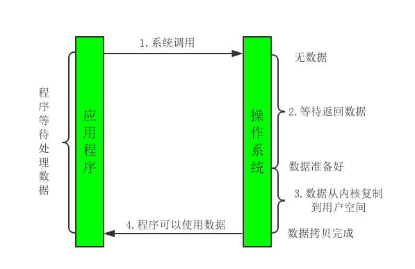
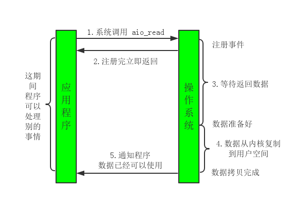

本文内容涉及同步与异步, 阻塞与非阻塞, BIO、NIO、AIO等概念, 这块内容本身比较复杂, 很难用三言两语说明白. 而书上的定义更不容易理解是什么意思. 下面这些内容是按照我的理解, 以我认为尽可能简单易懂的语言组织出来, 希望能够帮助理解这些概念.

## 同步与异步
`同步与异步`的概念, 关注的是 **消息通信机制**

* `同步`是指发出一个请求, 在没有得到结果之前该请求就不返回结果, 请求返回时, 也就得到结果了.

比如洗衣服, 把衣服放在洗衣机里, 没有洗好之前我们一直看着, 直到洗好了才拿出来晾晒.

* `异步`是指发出一个请求后, 立刻得到了回应, 但没有返回结果. 这时我们可以再处理别的事情(发送其他请求), 所以这种方式需要我们通过状态主动查看是否有了结果, 或者可以设置一个回调来通知调用者.

比如洗衣服时, 把衣服放到洗衣机里, 我们就可以去做别的事情, 过会儿来看看有没有洗好(通过状态查询);   
或者我们设置洗衣机洗完后响铃来通知我们洗好了(回调通知)

## 阻塞与非阻塞

`阻塞与非阻塞`很容易和`同步与异步`混淆, 但两者关注点是不一样的. `阻塞与非阻塞`关注的是 **程序在等待调用结果时的状态**

* `阻塞`是指请求结果返回之前, 当前线程会被挂起(被阻塞), 这时线程什么也做不了
* `非阻塞`是指请求结果返回之前, 当前线程没有被阻塞, 仍然可以做其他事情.

`阻塞`有个明显的特征就是线程通常是处于`BLOCKED`状态(BIO中的`read()`操作时, 线程阻塞是JVM配合OS完成的, 此时Java获取到线程的状态仍是`RUNNABLE`但它确实已经被阻塞了)

如果要拿`同步`来做比较的话, 同步通信方式中的线程在发送请求之后等待结果这个过程中应该处于`RUNNABLE`状态, 同步必须一步一步来完成, 就像是代码必须执行完一行才能执行下一行, 所以必须等待这个请求返回之后才可进行下一个请求, 即使等待结果的时间长, 也是在执行这个请求的过程中. 而`异步`则不用等上一条执行完, 可以先执行别的代码, 等请求有了结果再来获取结果.

## IO模型

Java中的IO操作是JVM配合操作系统来完成的. 对于一个IO的读操作, 数据会先被拷贝到操作系统内核的缓冲区中, 然后从操作系统内核的缓冲区拷贝到应用程序的地址空间. 所以整个过程可分为两个阶段:

1. 等待I/O数据准备好. 这取决于IO目标返回数据的速度, 如网络IO时看网速和数据本身的大小.
2. 数据从内核缓冲区拷贝到进程内.

根据这两个阶段, 产生了常见的几种不同的IO模型: `BIO`, `NIO`, `IO多路复用`和`AIO`.

### BIO

`BIO`即`Blocking I/O`(阻塞 I/O), BIO整个过程如下图:

程序发送请求给内核, 然后由内核去进行通信, 在内核准备好数据之前这个线程是被挂起的, 所以在两个阶段程序都处于挂起状态.

* BIO的特点就是在IO执行的两个阶段都被block了

### NIO

`NIO`即`Non-Blocking I/O`(非阻塞 I/O), NIO整个过程如下图:

与BIO的明显区别是, 发起第一次请求后, 线程并没有被阻塞, 它反复检查数据是否准备好, 把原来大块不能用的阻塞时间分成了许多"小阻塞"(检查), 所以进程不断有机会被执行. 这个检查有没有准备好数据的过程有点类似于"轮询".

* NIO的特点就是程序需要不断的主动询问内核数据是否准备好。第一个阶段非阻塞, 第二个阶段阻塞

### IO多路复用

IO多路复用(`I/O Multiplexing`)有`select`, `poll`, `epoll`等不同方式, 它的优点在于单个线程可以同时处理多个网络IO.

`NIO`中轮询操作是用户线程进行的, 如果把这个任务交给其他线程, 则用户线程就不用这么费劲的查询状态了. `IO多路复用`调用系统级别的`select`或`poll`模型, 由系统进行监控IO状态. select轮询可以监控许多socket的IO请求, 当有一个socket的数据准备好时就可以返回.

* select: 注册事件由数组管理, 数组是有长度的, 32位机上限1024, 64位机上限2048. 轮询查找时需要遍历数组.
* poll: 把select的数组采用链表实现, 因此没了最大数量的限制
* epoll方式: 基于事件回调机制, 回调时直接通知进程, 无须使用某种方式来查看状态.

多路复用IO过程图:

用户线程有一段时间是阻塞的, 从上图来看, 与`NIO`很像, 但与NIO不一样的是, select不是等到所有数据准备好才返回, 而是只要有一个准备好就返回, 它的优势在于可以同时处理多个连接. 若连接不是很多的话, 它的效率不一定高, 可能还会更差.

`Java 1.4`开始支持`NIO(New IO)`, 就是采用了这种方式, 在套接字上提供`selector`选择机制, 当发起`select()`时会阻塞等待至少一个事件返回.

* 多路复用IO的特点是用户进程能同时等待多个IO请求, 系统来监控IO状态, 其中的任意一个进入读就绪状态, select函数就可以返回.

### AIO
`AIO`即`Asynchronous I/O`(异步 I/O), 这是`Java 1.7`引入的`NIO 2.0`中用到的. 整个过程中, 用户线程发起一个系统调用之后无须等待, 可以处理别的事情. 由操作系统等待接收内容, 接收后把数据拷贝到用户进程中, 最后通知用户程序已经可以使用数据了, 两个阶段都是非阻塞的. AIO整个过程如下图:

`AIO`属于异步模型, 用户线程可以同时处理别的事情, 我们怎么进一步加工处理结果呢? Java在这个模型中提供了两种方法:

1. 一种是基于"回调", 我们可以实现`CompletionHandler`接口, 在调用时把回调函数传递给对应的API即可
2. 另一种是返回一个`Future`. 处理完别的事情, 可以通过`isDone()`可查看是否已经准备好数据, 通过`get()`方法等待返回数据.

### 小结

上面这几种模式, `BIO`整个过程都等待返回, `NIO`和`IO多路复用`在第二个阶段等待返回, 因此从整个过程来看, 这三个模式都属于同步方式. `AIO`在整个过程中没有等待返回, 属于异步方式.
