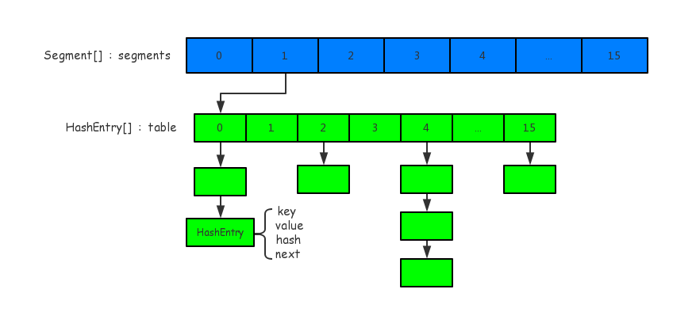

`HashMap`是非线程安全的, 对应的线程安全版本是`HashTable`, 但`HashTable`加锁的粒度大,`synchronized`是针对整个哈希表的, 效率低. 后来`JDK1.5`出现了`ConcurrentHashMap`, 通过引入`Segment`进行分段加锁, 从而提高并发效率.


## 存储结构
`HashMap`的数据结构是数组加链表的形式。结构大体如下:



可以看出`ConcurrentHashMap`有点像把`HashTable`又包了一层, 把`table`放到了`segments`里, 这样同步锁是在每一个`segment`里的, 只要多个修改操作发生在不同的段上, 它们就可以并发进行. 我们为了区分, 把每个元素`segment`成为`段`(有的文章里称作`桶`), 把`segment`里面的`table`的单个元素成为`桶`.

我们来看看`Segment`的结构, 跟`HashMap`里的结构非常类似:

```java
    static final class Segment<K,V> extends ReentrantLock implements Serializable {
        transient volatile HashEntry<K,V>[] table; // 桶, 除了类型, 其他跟HashMap里的table一样
        transient int count;     // HashEntry的总个数, 对应HashMap里的size
        transient int modCount;  // 同HashMap
        transient int threshold; // 同HashMap, 用于rehash, rehash时只会改变table的大小, segments大小确定之后就不会再变了
    }
```

## 需要知道的概念
`ConcurrentHashMap`比`HashMap`多了一层, 新增了几个概念:

* `segments`: 一个数组, 可称为`段`, 该数组的大小总是`2的n次幂`, 默认是16
* `concurrencyLevel`: 并发等级, 实际上就是`segments`数组的大小, 一旦确定就不再改变, 扩容时不会增加Segment的数量, 而只会增加`Segment`中链表数组(`table`)的容量大小
* `segmentShift`: 假设`segments`的大小是`2的n次方`, 则`segmentShift = 32-n`
* `segmentMask`: 用于计算在`segments`中下标的掩码, 假设`segments`的大小是`2的n次方`, 则`segmentMask = 2的n次方-1`

## 构造方法
`ConcurrentHashMap`有重载了5个构造方法, 实现都是类似的, 直接从代码中解释

```java
    public ConcurrentHashMap(int initialCapacity, float loadFactor, int concurrencyLevel) {
       if (!(loadFactor > 0) || initialCapacity < 0 || concurrencyLevel <= 0)
           throw new IllegalArgumentException();
       if (concurrencyLevel > MAX_SEGMENTS)
           concurrencyLevel = MAX_SEGMENTS;
       // Find power-of-two sizes best matching arguments
       int sshift = 0;
       int ssize = 1;
       while (ssize < concurrencyLevel) {
           ++sshift;     // 移位的次数
           ssize <<= 1;  // segments的size, 数值上为大于等于concurrencyLevel的最小的那个 2的n次幂
       }
       this.segmentShift = 32 - sshift;
       this.segmentMask = ssize - 1;
       if (initialCapacity > MAXIMUM_CAPACITY)
           initialCapacity = MAXIMUM_CAPACITY;
       int c = initialCapacity / ssize;       // 默认的情况下 c = 16/16 = 1
       if (c * ssize < initialCapacity)
           ++c;                               // c是并发等级的向上取整倍
       int cap = MIN_SEGMENT_TABLE_CAPACITY;  // tables的容量, 最少为2
       while (cap < c)
           cap <<= 1;                         // 容量是比c大的最小2次幂, 最小为2, 默认也为2
       // 创建segments[0]
       Segment<K,V> s0 =
           new Segment<K,V>(loadFactor, (int)(cap * loadFactor),   // loadFactor, threshold
                            (HashEntry<K,V>[])new HashEntry[cap]); // 这个Segment中的tables也直接创建了, 注意默认情况下tables的每个桶中只有2个结点
       Segment<K,V>[] ss = (Segment<K,V>[])new Segment[ssize];  // 创建segments, 这里可以看出ssize是真正的并发等级
       UNSAFE.putOrderedObject(ss, SBASE, s0); // 只有segments[0]有值, 这是为了给创建其他位置的segment时提供模板
       this.segments = ss;
   }
```

## 关于hash定位
`ConcurrentHashMap`中的定位分两部分, 一部分是定位段`segments`, 一部分是定位桶`table`, 两个都直接使用`key`的哈希值`hash`进行定位; 段`segments`通过`hash`的高位定位, 桶`table`通过`hash`的低位定位.

```java
    // 定位段: hash值无符号右移(32-n)位, 比如默认16时, n=4; 然后再与低n位按位与, 就得到了在段中的位置j
    int j = (hash >>> segmentShift) & segmentMask;
    // 获取segment的函数
    private Segment<K,V> segmentForHash(int h) {
        // SBASE为数组中第一个元素的偏移地址, SSHIFT为数组寻址的换算因子, 两个必须配合使用
        // 这两行代码相当于在segments中获取下标为j的Segment
        long u = (((h >>> segmentShift) & segmentMask) << SSHIFT) + SBASE;
        return (Segment<K,V>) UNSAFE.getObjectVolatile(segments, u);
    }

    // 定位桶: hash直接取低位和(table的长度-1)按位与, 就得到了在桶中的下标index
    int index = (tab.length - 1) & hash;
    HashEntry<K,V> first = entryAt(tab, index);  // 获取桶中下标为index的结点
```

## 添加元素put

* 刚创建的`ConcurrentHashMap`中的`segments`只有位置`0`不为空, 其他位置还没创建`Segment`
* 添加元素时, 若对应位置的段`segment`为`null`则先创建`segment`
* 添加元素时, 先定位到段`segment`, 再转化为`segment.put()`
* `segments`的大小不再改变, 涉及扩容时, 只有`table`大小会变
* `put`操作时要在对应的`segment`上加锁

```java
    // ConcurrentHashMap的put,外层不加锁, 段内加锁
    public V put(K key, V value) {
        Segment<K,V> s;
        if (value == null)
            throw new NullPointerException();
        int hash = hash(key);                            // 获取key的哈希值
        int j = (hash >>> segmentShift) & segmentMask;   // 段索引
        if ((s = (Segment<K,V>)UNSAFE.getObject          // 获取j位置的Segment, 如果为null, 则创建
             (segments, (j << SSHIFT) + SBASE)) == null)
            s = ensureSegment(j);                        // 在ensureSegment还要多次检查取保不为null才会真正创建, 并且通过CAS赋值, 创建时, cap, loadFactor和threshold都是以s0为模板创建的
        return s.put(key, hash, value, false);           // 转嫁给了Segment的put
    }
    // Segment的put, 这里面才会加锁
    final V put(K key, int hash, V value, boolean onlyIfAbsent) {
        HashEntry<K,V> node = tryLock() ? null :  // 尝试加锁, 加锁成功返回true, 否则返回false
            scanAndLockForPut(key, hash, value);  // 加锁失败时, 循环尝试加锁, 试几次后, 阻塞等待加锁(这个函数中还试图创建HashEntry)
        V oldValue;
        try {
            HashEntry<K,V>[] tab = table;
            int index = (tab.length - 1) & hash;  // 桶下标
            HashEntry<K,V> first = entryAt(tab, index);  // table的index位置的元素
            for (HashEntry<K,V> e = first;;) {  // 死循环, 只能从里面跳出
                if (e != null) {    // 桶中已有其他结点, 找是否key已存在
                    K k;
                    if ((k = e.key) == key ||    // 如果key一样, 覆盖原值, 跳出循环
                        (e.hash == hash && key.equals(k))) {
                        oldValue = e.value;      // 记录被替换掉的旧值
                        if (!onlyIfAbsent) {
                            e.value = value;    // 覆盖原值
                            ++modCount;
                        }
                        break;  //  跳出循环
                    }  // key 不一样就向后移动
                    e = e.next;  // 向后移动
                }
                else {  // 桶中还没结点
                    if (node != null)  // 如果新加的结点已经创建好了, next字段指向first
                        node.setNext(first);
                    else  // 没创建好则创建一个, 也是next字段指向first
                        node = new HashEntry<K,V>(hash, key, value, first);
                    int c = count + 1;  // 结点数量+1
                    if (c > threshold && tab.length < MAXIMUM_CAPACITY)  // 看是否需要扩容
                        rehash(node);  // 扩容
                    else
                        setEntryAt(tab, index, node);  // 头插, 放到桶位置的链表头
                    ++modCount;  // 修改次数加一
                    count = c;   // 记录结点数量
                    oldValue = null;  // 新结点, 被替换掉的旧值为null
                    break;  // 跳出循环
                }
            }
        } finally {
            unlock();  // 重入锁一般都会在finally中解锁, 否则很容易发生死锁
        }
        return oldValue;
    }
```

## 删除元素remove

* remove元素也是先定位到段`segment`, 再转化为`segment.remove()`
* `remove`操作时也要在相应的`segment`上加锁

```java
    // 外层remove加锁
    public V remove(Object key) {
        int hash = hash(key);
        Segment<K,V> s = segmentForHash(hash);  // 定位段
        return s == null ? null : s.remove(key, hash, null); // 转交给段remove
    }
    // 段内的remove, 需要加锁
    final V remove(Object key, int hash, Object value) {
        if (!tryLock())   // 先加锁
            scanAndLock(key, hash);
        V oldValue = null;
        try {
            HashEntry<K,V>[] tab = table;           // 桶
            int index = (tab.length - 1) & hash;    // 桶下标
            HashEntry<K,V> e = entryAt(tab, index); // 桶中链表头
            HashEntry<K,V> pred = null;             // 前驱结点
            while (e != null) {
                K k;
                HashEntry<K,V> next = e.next;
                if ((k = e.key) == key ||
                    (e.hash == hash && key.equals(k))) {  // 如果key一样
                    V v = e.value;
                    if (value == null || value == v || value.equals(v)) {  // 找到待删除的结点
                        if (pred == null)  // 前驱结点为空, 说明表头应该被删除,直接把e.next作为表头
                            setEntryAt(tab, index, next);
                        else
                            pred.setNext(next); // 前驱结点不为空, 前驱结点直接指向e.next
                        ++modCount;   // 修改次数+1
                        --count;      // 结点数量-1
                        oldValue = v; // 记录旧值
                    }
                    break;  // 找到并删除节点后, 跳出循环
                }
                pred = e; // 前驱结点后移
                e = next; // 待比较结点后移
            }
        } finally {
            unlock();   // finally中解锁
        }
        return oldValue;
    }
```

## 获取元素get

* `get`操作不需要加锁(弱一致性)

```java
    public V get(Object key) {
        Segment<K,V> s;        // 段
        HashEntry<K,V>[] tab;  // 段内table
        int h = hash(key);     // hash值
        long u = (((h >>> segmentShift) & segmentMask) << SSHIFT) + SBASE;
        // 对应的段和段内桶都不为null
        if ((s = (Segment<K,V>)UNSAFE.getObjectVolatile(segments, u)) != null &&
            (tab = s.table) != null) {
            // 从桶中链表头开始, 不断向后查找
            // 这个get只保证了读取链表头的时候是一个原子操作, 但是有可能读出表头之后, 表头被别的线程删除了
            // 因此get返回的可能是过时的数据，这一点是ConcurrentHashMap在弱一致性上的体现
            // 如果要求强一致性，那么必须使用Collections.synchronizedMap()方法
            for (HashEntry<K,V> e = (HashEntry<K,V>) UNSAFE.getObjectVolatile
                     (tab, ((long)(((tab.length - 1) & h)) << TSHIFT) + TBASE);
                 e != null; e = e.next) {
                // 刚到这里就有可能e结点已经被别的线程删除了(弱一致性)
                K k;
                if ((k = e.key) == key || (e.hash == h && key.equals(k)))
                    return e.value;  // 如果key一样就返回
            }
        }
        return null;
    }
```

## 锁全段操作size/containsValue

* `size`和`containsValue`操作的代价比较大, 需要锁住所有的段

```java
    // 两个操作里都有这段代码, 把所有的段都加锁
    for (int j = 0; j < segments.length; ++j)
        ensureSegment(j).lock(); // force creation
```
