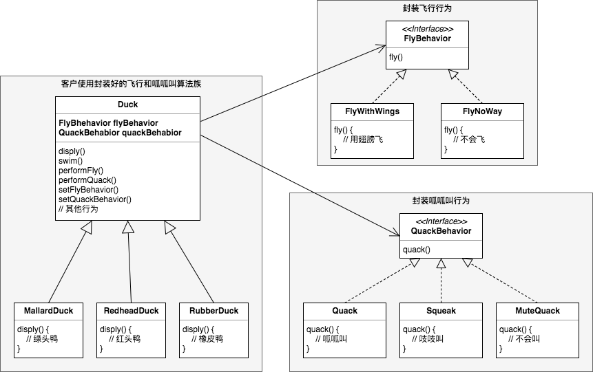

## 设计原则

* `找出应用中可能需要变化之处, 把它们独立出来, 不要和那些不需要变化的代码混在一起`

把会变化的部分取出并封装起来, 以便以后可以轻易地改动或扩充此部分, 而不影响不需要变化的其他部分

* `针对接口编程, 而不是针对实现编程`

针对接口编程的真正意思是: 针对超类型(`supertype`)编程。  
接口这个词有多个含义, 既是一个概念, 也`Java中的interface`, 我们可以在不涉及`Java interface`的情况下针对接口编程, 关键就在于利用`多态`。  
利用`多态`可以`针对超类型编程`, 可以更明确的说成变量的声明类型应该是超类型, 通常是一个抽象类或者一个接口, 这也意味着声明类时不用理会执行时的真正对象类型。 例如, 有一个抽象类`Animal`, 有两个实现类Dog与Cat继承了`Animal`:

* `为了交互对象之间的松耦合设计而努力`

```java
// 针对实现编程
Dog d = new Dog();
d.bark();
// 针对实现(超类型)编程
Animal animal = new Dog();
animal.makeSound();
```

* `多用组合, 少用继承`

`有一个`比`是一个`更好, 组合建立的系统比继承往往具有更大的弹性


## 策略模式

* 定义
> 定义了算法族, 分别封装起来, 让他们之间可以相互替换, 此模式让算法的变化独立于使用算法的客户。

* 类图



## 观察者模式
观察者模式需要有一个`主题(Subject)`和许多`观察者(Observer)`, Java内置了观察者模式: 类`Observable`和接口`Observer`

* 定义
> 定义了对象之间的一对多依赖, 这样一来, 当一个对象改变状态时, 它的所有依赖者都会受到通知并自动更新

```java
// 可观察者
public class Observable {
    private boolean changed = false;
    private Vector<Observer> obs;

    /** 无参构造器, 初始化存放观察者的列表 */
    public Observable() {
        obs = new Vector<>();
    }

    /**
     * 添加观察者
     */
    public synchronized void addObserver(Observer o) {
        if (o == null)
            throw new NullPointerException();
        if (!obs.contains(o)) {
            obs.addElement(o);
        }
    }

    /**
     * 删除观察者
     */
    public synchronized void deleteObserver(Observer o) {
        obs.removeElement(o);
    }

    /**
     * 变化通知观察者
     */
    public void notifyObservers() {
        notifyObservers(null);
    }

    /**
     * 变化通知观察者, 可携带参数
     */
    public void notifyObservers(Object arg) {
        /*
         * 用于存放当前观察者的快照
         */
        Object[] arrLocal;

        synchronized (this) {
             // 无变化则不通知
            if (!changed)
                return;
            /* 使用快照这种方式的极端情况
            * 1) 新添加的观察者可能错过本次通知
            * 2) 新删除的观察者可能会被误通知到
            */
            arrLocal = obs.toArray();
            // 保存了要通知的观察者之后, 修改变化状态
            clearChanged();
        }
        // 挨个通知
        for (int i = arrLocal.length-1; i>=0; i--)
            ((Observer)arrLocal[i]).update(this, arg);
    }

    /**
     * 删除所有观察者
     */
    public synchronized void deleteObservers() {
        obs.removeAllElements();
    }

    /**
     * 标记有数据变化
     */
    protected synchronized void setChanged() {
        changed = true;
    }

    /**
     * 清除数据变化标记
     */
    protected synchronized void clearChanged() {
        changed = false;
    }

    /**
     * 判断是否有变化
     */
    public synchronized boolean hasChanged() {
        return changed;
    }

    /**
     * 返回观察者的数量
     */
    public synchronized int countObservers() {
        return obs.size();
    }
}
// 观察者
public interface Observer {
    /**
     * 被观察的对象变化时, 该方法会被调用
     */
    void update(Observable o, Object arg);
}
```