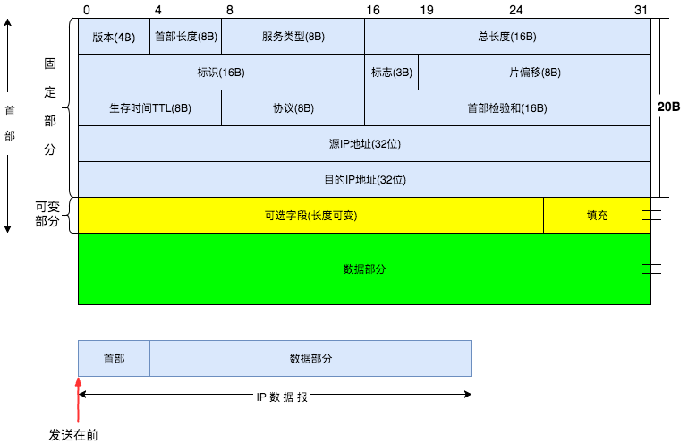
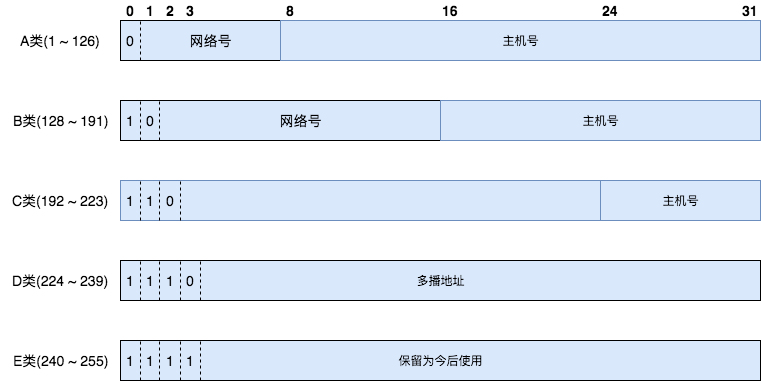

## IPv4数据报
一个IP分组由首部和数据两部分组成。首部的前一部分是固定长度的, 共`20B`, 是所有IP分组必须具有的。在首部固定部分后面是一些可选字段, 其长度是可变的。 IP数据报的格式如下图所示:

IP首部的字段含义如下:

* 版本: IP协议的版本，目前的IP协议版本号为4，下一代IP协议版本号为6。
* 首部长度: IP报头的长度, 固定部分的长度(20B)和可变部分的长度之和。共占4位, 以`4字节(32bit)`为单位, 即报头的最大长度可以为`15*4B=60B`, 除去固定部分的长度`20字节`, 可变部分的长度最大为`40字节`。
* 服务类型: Type Of Service(TOS), 占8位, 其中的前3位表示报文的优先级, 后面的几位分别表示要求更低时延、更高的吞吐量、更高的可靠性、更低的路由代价等。对应位为1即有相应要求, 为0则不要求。
  * `bit 0~2`: 优先级
  * `bit 3`: 延迟, 0 = Normal Delay, 1 = Low Delay
  * `bit 4`: 吞吐量, 0 = Normal Throughput, 1 = High Throughput
  * `bit 5`: 可靠性, 0 = Normal Relibility, 1 = High Relibility
  * `bit 6~7`: Reserved for Future Use. 6: 开销(路由代价); 7: 仍为保留
* 总长度: 报文的总长度, 单位为字节, 所以一个IP报文的的最大长度为65535B。
* 标识: 每产生一个报文就加1, 通常与标记字段和分片字段一起用于数据包的分段。当IP报文长度超过传输网络的`MTU`(最大传输单元)时, 必须分片, 此时这个标识字段的值被复制到所有数据分片的标识字段中, 以便这些分片在达到最终目的地时可以重新组合起来。
* 标志: 共3位, 分别为`R(Reserved)、DF(Don't Fragment)、MF(More Fragment)`, 目前只有后两位有效, `DF=1`表示不分片, `DF=0`表示分片; `MF=1`表示后面还有分片，`MF=0`表示这是最后一片。
* 片偏移: 本分片在原先数据报文中相对首位的偏移位, 13位, 以`8B`为偏移单位, 所以一个分片的长度一定是`8B(64bit)`的整数倍
  * 举例: 若`MTU=1500`时, 一个大小为3000字节的数据经过该接口, 会被分为3段, 第一段分组总长度为`1480+20`, 第二段也为`1480`, 第三段为`40`, 那么第一段的分段偏移为`0`, 第二段分段偏移为`1480/8=185`, 第三段为`185+185=370`
* 生存时间: TTL(Time to Live), 标识分组在网络中的寿命, 以确保分组不会永远在网络中循环。路由在转发分组之前, 先把`TTL`减1, 为0时则丢弃该分组。推荐的初始值由分配数字`RFC`指定, 当前值为`64`, 发送`ICMP`回显应答时经常把`TTL`设为最大值`255`
* 协议: 标识IP分组携带的数据使用的是那种协议, 以便目的主机的IP层能知道要将数据报上交到哪个进程(与端口号类似, 这里采用的是协议号)
  * 1: Internet Control Message Protocol (`ICMP`)
  * 2: Internet Group Management Protocol (`IGMP`)
  * 4: IP in IP (encapsulation)
  * 6: Transmission Control Protocol (`TCP`)
  * 17: User Datagram Protocol (`UDP`)
  * 45: Inter-Domain Routing Protocol (`IDRP`)
  * 46: Resource Reservation Protocol (`RSVP`)
  * 47: Generic Routing Encapsulation (`GRE`)
  * 54: NBMA Next Hop Resolution Protocol (`NHRP`)
  * 88: Cisco Internet Gateway Routing Protocol (`IGRP`)
  * 89: Open Shortest Path First (`OSPF`)
* 首部校验和: 首部的校验和, 检查首部的完整性(只校验首部, 不校验数据部分)
* 源IP地址: 发送方IP地址
* 目的IP地址: 接收方IP地址
* 可选字段: 包括源点产生的信息和其它路由器加入的信息, 可选字段, 主要用于测试, 长度可变
* 填充: 通过在可选字段后面添加0来补足32位, 确保报头长度是32的倍数

## IPv4地址分类
现在的IP网络使用32位地址表示, 以点分十进制表示. IP地址由`网络号`和`主机号`两部分组成, 根据网络号的不同分为A类地址、B类地址、C类地址、D类地址和E类地址5种类型, 如下图:

* 主机号全0表示网络本身, 如`202.98.174.0`
* 主机号全1表示本网络的广播地址, 如`202.98.174.255`
* `127.0.0.0`网络保留作为环路自检地址
* 32位全0, 即`0.0.0.0`表示本网络上的本主机
* 32位全1, 即`255.255.255.255`表示整个`TCP/IP`网络的广播地址, 由于路由器对广播域的隔离, 所以等效为本网络的广播地址

## 网络地址转换`NAT`
网络地址转换(`NAT`)通过将专用地址转换为公用地址, 隐藏了内部网络结构, 节省了IP地址消耗. 私有IP必须经过NAT转换成公网IP才可用于互联网. NAT路由器使用NAT转换表(存放着`私有IP:端口`到`全球IP:端口`的映射)可以把多个私有IP都映射到同一个公网IP上.

私有IP地址网段如下:

* A类: 1个网段, 即`10.0.0.0 ~ 10.255.255.255`
* B类: 16个网段, 即`172.16.0.0 ~ 172.31.255.255`
* C类: 256个网段, 即`192.168.0.0 ~ 192.168.255.255`

注意: 普通路由器转发IP数据报时不改变源和目的IP地址, 而NAT路由转发时一定会改变其IP地址, 而且需要查看传输层的端口.

## 子网与CIDR

### 子网划分

* 从1985年起, 在IP地址中又增加了一个`子网号字段`, 两级IP地址变成三级, 即三级IP地址由`网络号`, `子网号`和`主机号`三部分组成。
* 划分子网只是把IP地址的`主机号`这部分进行再划分, 不会改变原来的`网络号`, 从IP数据报中无法判断源或目的主机是否进行了子网划分

### 子网掩码
子网掩码是跟IP地址相对应的32位二进制串, 1对应网络号及子网号, 0对应主机号。子网掩码与IP地址按位相与(`AND`)即可得到相应子网的网络地址。 如果一个网络没有划分子网, 那就使用默认子网掩码, `A、B、C`类地址默认的子网掩码分别为`255.0.0.0`, `255.255.0.0`和`255.255.255.0`

子网掩码是一个网络中的重要属性, 路由之间交换信息时, 必须把自己所在网络的子网掩码告诉对方。在使用子网掩码的情况下:

1. 一个主机在设置IP地址信息的同时, 必须设置子网掩码
2. 同属于一个字网的所有主机及路由器的相应端口, 必须设置相同的子网掩码
3. 路由器的路由表中包含的主要信息必须有: `目的网络地址`, `子网掩码`, `下一跳地址`

### 无分类编址`CIDR`
`CIDR`(Classless Inter-Domain Routing)消除了传统的A、B、C类地址以及划分子网的概念, 更加有效地分配IPv4的地址空间, 提高了IP地址空间利用率, 减小路由表大小, 提高路由转发能力。 它有如下特点:

* `CIDR`使用“斜线记法”(又称为CIDR记法), 即`IP地址/网络前缀位数`, 如`128.14.32.5/20`表示掩码为前20位全1和后12位全0, 即网络前缀为`128.14.32.0`
* 网络前缀县通的连续的IP地址组成`CIDR地址块`, 一个CIDR地址块可以包括多个ABC类地址
* 使用CIDR时, 在路由表可能得到多个匹配结果, 应采用`最长前缀匹配`原则, 选取最长的网络前缀匹配
